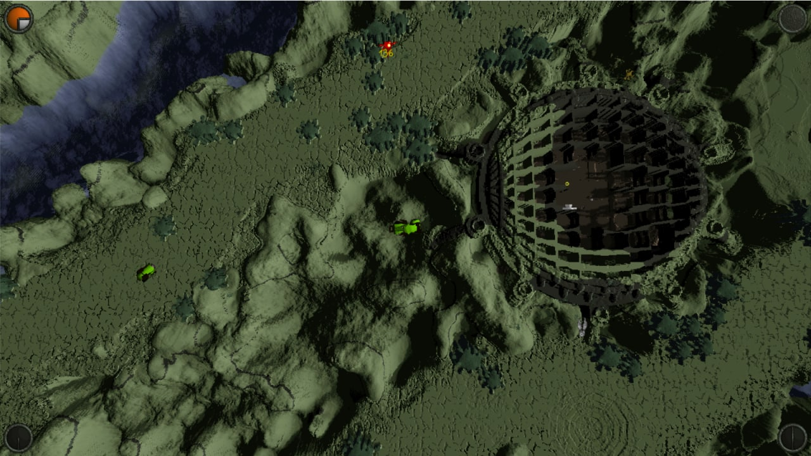
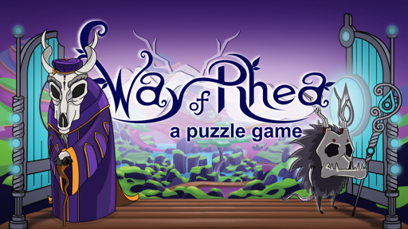
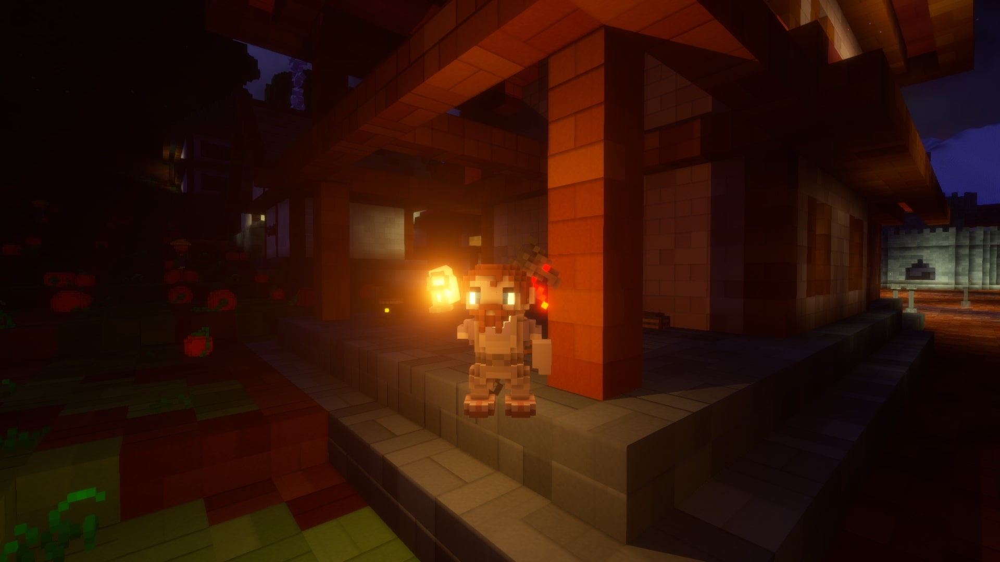
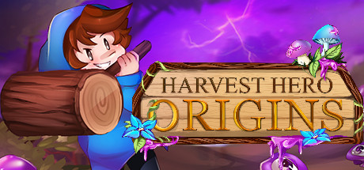
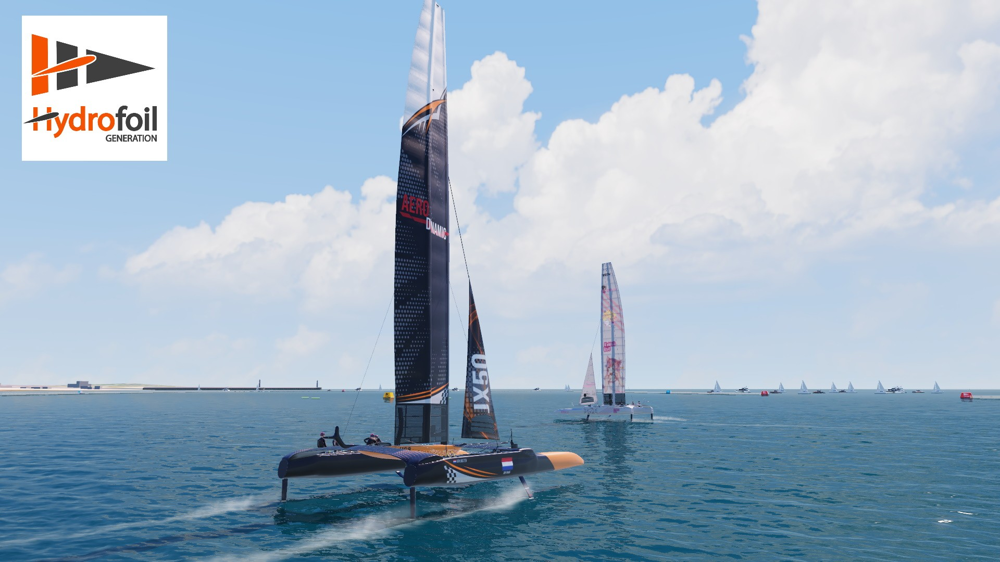
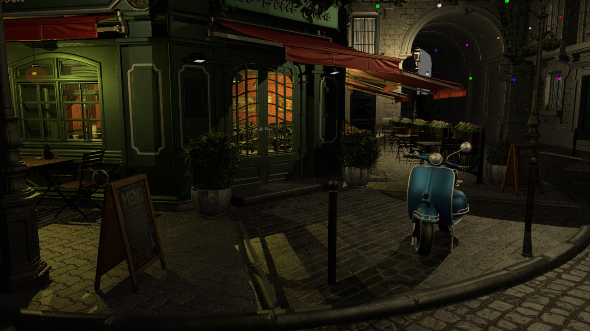
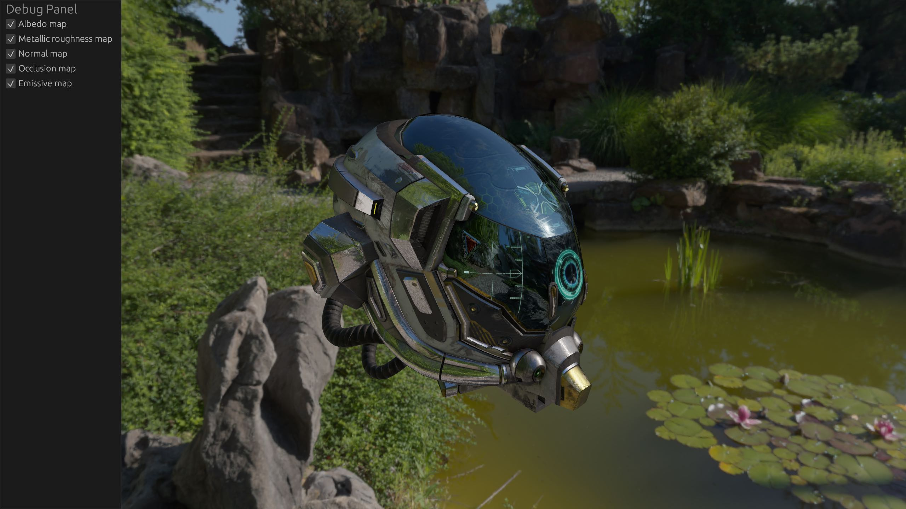
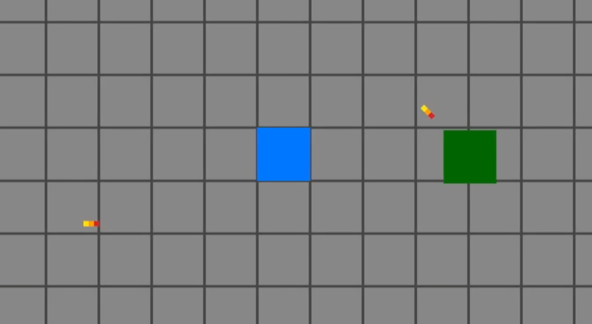
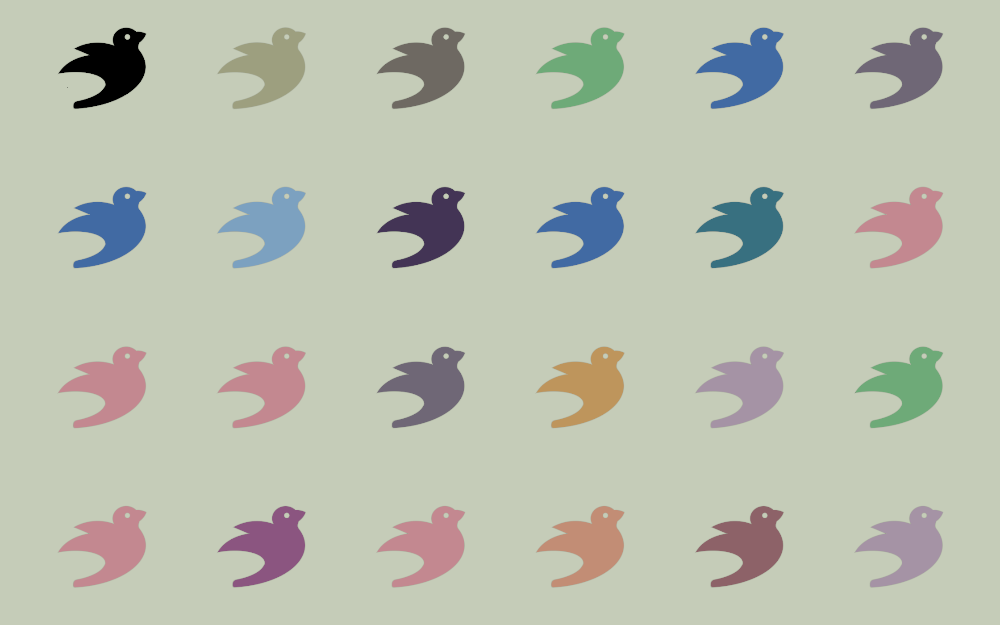

+++
title = "This Month in Rust GameDev #30 - January 2022"
transparent = true
date = 2022-02-10
+++

<!-- no toc -->

<!-- Check the post with markdownlint-->

Welcome to the 30th issue of the Rust GameDev Workgroup's
monthly newsletter.
[Rust] is a systems language pursuing the trifecta:
safety, concurrency, and speed.
These goals are well-aligned with game development.
We hope to build an inviting ecosystem for anyone wishing
to use Rust in their development process!
Want to get involved? [Join the Rust GameDev working group!][join]

You can follow the newsletter creation process
by watching [the coordination issues][coordination].
Want something mentioned in the next newsletter?
[Send us a pull request][pr].
Feel free to send PRs about your own projects!

[Rust]: https://rust-lang.org
[join]: https://github.com/rust-gamedev/wg#join-the-fun
[pr]: https://github.com/rust-gamedev/rust-gamedev.github.io
[coordination]: https://github.com/rust-gamedev/rust-gamedev.github.io/issues?q=label%3Acoordination
[Rust]: https://rust-lang.org
[join]: https://github.com/rust-gamedev/wg#join-the-fun

- [Rust GameDev Meetup](#rust-gamedev-meetup)
- [Game Updates](#game-updates)
- [Learning Material Updates](#learning-material-updates)
- [Engine Updates](#engine-updates)
- [Tooling Updates](#tooling-updates)
- [Library Updates](#library-updates)
- [Other News](#other-news)
- [Discussions](#discussions)
- [Requests for Contribution](#requests-for-contribution)
- [Jobs](#jobs)

<!--
Ideal section structure is:

```
### [Title]


_image caption_

A paragraph or two with a summary and [useful links].

_Discussions:
[/r/rust](https://reddit.com/r/rust/todo),
[twitter](https://twitter.com/todo/status/123456)_

[Title]: https://first.link
[useful links]: https://other.link
```

If needed, a section can be split into subsections with a "------" delimiter.
-->

## Rust GameDev Meetup


The twelfth Rust Gamedev Meetup happened in January. You can watch the
recording of the meetup [here on Youtube][gamedev-meetup-video]. The meetups
take place on the second Saturday every month via the [Rust Gamedev Discord
server][rust-gamedev-discord] and are also [streamed on
Twitch][rust-gamedev-twitch].

[gamedev-meetup-video]: https://youtu.be/BIMsBFbPV-c
[rust-gamedev-discord]: https://discord.gg/yNtPTb2
[rust-gamedev-twitch]: https://twitch.tv/rustgamedev
[gamedev-meetup-form]: https://forms.gle/BS1zCyZaiUFSUHxe6
[rust-meetup-feb-time]: https://everytimezone.com/s/48bc48be

## Game Updates

### Flesh


_the second level's background + new enemy_

[Flesh] by [@im_oab] is a 2D-horizontal shmup game with hand-drawn animation and
an organic/fleshy theme. It is implemented using [Tetra]. This month's updates
include:

- The completed first level, with a mid-boss and main boss.
- The second level of the game with new enemies.

[Flesh]: https://store.steampowered.com/app/1660850/Flesh/
[@im_oab]: https://twitter.com/im_oab
[Tetra]: https://github.com/17cupsofcoffee/tetra

### [Rusty Vangers]


_Rusty Vangers engine in action within the original game_

[Rusty Vangers] by [@kvark] is a modern re-implementation of the original
[Vangers] game from the last century.
It's in Rust, and uses GPU and multiple threads heavily.

Something incredible has been brewing within the small but dedicated community
of the original game. They prototyped a pluggable rendering interface in order
to support rendering the game via [Rusty Vangers] instead of the default
CPU-based rasterizer. The plugin is made as a static library sub-crate with a
bunch of C-exported functions.
The approach worked for the terrain, so the mini working group transitioned
to moving more visual features off the old path and into the Rust-based plugin.

At the same time, [Rusty Vangers] engine got a number of important
fixes and additions:

- water is rendered fair as transparent surfaces
- lighting evaluation on the second layer is fixed
- dynamic terrain and palette modification is supported
- custom viewport support
- can render menu screens, not just the game levels

[Rusty Vangers]: https://vange.rs
[Vangers]: https://www.gog.com/en/game/vangers
[@kvark]: https://github.com/kvark/

### [Way of Rhea][wor]



[Way of Rhea][wor] is a puzzle adventure with hard puzzles and forgiving
mechanics being produced by [@masonremaley][wor-mason-remaley] in a custom Rust
engine. It has a demo available [on Steam][wor].

Latest developments:

- [Making Your Game Go Fast by Asking Windows Nicely][wor-fast] was published,
  discussing Windows-specific performance tweaks in Way of Rhea's engine
- Work started on the Snowcrab + Teleporter puzzles, completing nearly all the
  puzzles in the main game
- Work began on art for The Professor (pictured left), Shrew, and Hermes
- Work began on artwork for the Mushroom Biome, and continued on the Hub World
- The narrative was reworked, and the dialogue system was improved
- The main menu, pause menu, and option screen UIs were replaced

You can stay up to date with the latest Way of Rhea developments by
[following it on Steam][wor], signing up for [their mailing list][wor-newsletter],
or joining [their Discord][wor-discord].

[wor]: https://store.steampowered.com/app/1110620/Way_of_Rhea/?utm_campaign=tmirgd&utm_source=n30
[wor-mason-remaley]: https://twitter.com/masonremaley
[wor-newsletter]: https://www.anthropicstudios.com/newsletter/signup
[wor-fast]: https://www.anthropicstudios.com/2022/01/13/asking-windows-nicely/
[wor-discord]: https://discord.gg/JGeVt5XwPP

### [Garden of the Centaur][centaur-github]


_Screenshot of Garden of the Centaur_

Garden of the Centaur ([GitHub][centaur-github]) by
[@Syn-Nine][synnine-twitter] is an action-puzzle mini game where you navigate a
garden maze and steal the Centaur's gems. Getting caught spells certain doom.

The game was created using Syn9's [Rust Mini Game Framework][mgfw] and is
part of an open source [repository][s9-minigame-repo] of several mini-games
that use this framework.

[centaur-github]: https://github.com/Syn-Nine/rust-mini-games/tree/main/2d-games/centaur
[synnine-twitter]: https://twitter.com/Syn9Dev
[mgfw]: https://github.com/Syn-Nine/mgfw
[s9-minigame-repo]: https://github.com/Syn-Nine/rust-mini-games/

### [Kataster]


[Kataster] by [@Bobox214] is a single-screen space shooter mini-game,
using [bevy] and [heron] (powered by [rapier]).

Its goal is to be a simple demonstration game for [bevy], and provide newcomers
another example to look into when they begin their journey with the engine.

The latest version includes:

- Support for [bevy] 0.6
- A new shader background to showcase integration with the new renderer.

[Kataster]: https://github.com/Bobox214/Kataster
[bevy]: https://bevyengine.org/
[rapier]: https://rapier.rs
[heron]: https://github.com/jcornaz/heron
[@Bobox214]: https://github.com/Bobox214

### [Veloren][veloren]


_A light to keep the night away_

[Veloren][veloren] is an open world, open-source voxel RPG inspired by Dwarf
Fortress and Cube World.

In January, another [Veloren Reading Club was
recorded][veloren-reading-club-4]! The `entity_sync` system was refactored to
be parallel. This was the largest bottleneck during the last release party, and
this fix will allow us to more easily surpass the 200 player mark on the server.
Work has been done to improve dagger animations. Sounds for flowing rivers are
now more bubbly sounding. Work is happening to get the OpenGL renderer to work
with WGPU for Veloren, as the project transitioned to Vulkan, but wants to keep
backward compatibility for older GPUs.

Skiing and ice skating have gotten to a playable state. The mounts system was
overhauled to make it more ergonomic to work with, you can [watch a video of
that here][veloren-mounts]. Several experimental shaders have been
added, along with a "point glow" which help lanterns look better. With these new
shaders, swimming underwater is a whole new experience! A tracking issue was
created for worldgen issues that will help coordinate direction for some large
systems in the future.

January's full weekly devlogs: "This Week In Veloren...":
[#152][veloren-152],
[#153][veloren-153],
[#154][veloren-154],
[#155][veloren-155],
[#156][veloren-156].

[veloren]: https://veloren.net
[veloren-mounts]: https://www.youtube.com/watch?v=fJpeOJT78TI
[veloren-reading-club-4]: https://www.youtube.com/watch?v=nR2WDBMjkh8

[veloren-152]: https://veloren.net/devblog-152
[veloren-153]: https://veloren.net/devblog-153
[veloren-154]: https://veloren.net/devblog-154
[veloren-155]: https://veloren.net/devblog-155
[veloren-156]: https://veloren.net/devblog-156

### [Not Snake][notsnake]


Not Snake ([GitHub][notsnakegit], [Itch][notsnake]) by [Michael Ramirez] is a
3D snake game where you don't play as the snake.

Not Snake is being developed using the [Bevy game engine][notsnakebevy]. The
first version can be played [here][notsnake]. An updated version
is now being worked on since the 0.6 release of [Bevy][notsnakebevy].

The bulk of the work this month was spent on creating a level editor
using the [egui][notsnakeegui] and [bevy_mod_picking][notsnakepick] crates to
make it easier to add new features/modes to the game.

Current features include:

- Able to create, customize, and delete game entities
- Multi-select entities for bulk changes
- Can play-test levels in the editor
- Camera controls
- Save/Load levels

More details on the initial editor work and a retrospective of the first
version of the game can be read [here][notsnakepost] and a video of
the save/load feature can be seen [here][notsnakeyt].

[notsnake]: https://ramirezmike2.itch.io/not-snake
[notsnakepost]: https://ramirezmike2.itch.io/not-snake/devlog/333283/retrospective-working-on-new-features
[Michael Ramirez]: https://github.com/ramirezmike
[notsnakebevy]: https://bevyengine.org
[notsnakegit]: https://github.com/ramirezmike/not_snake_game
[notsnakeyt]: https://www.youtube.com/watch?v=cwI00pXDc6Q
[notsnakepick]: https://github.com/aevyrie/bevy_mod_picking
[notsnakeegui]: https://github.com/emilk/egui

### [Harvest Hero Origins] is now available



[Harvest Hero Origins] is an Arcade Wave Defense game that has been
in development by [Gemdrop Games] for the past 10 months.

It is the studio's first commercial release, developed in
the [Emerald] game engine.

The game is available now on Windows and Linux for $2.99 with
a launch discount of 10%!

The studio plans to provide free updates for a period of time,
before moving on to focusing 100% of their efforts on the sequel,
Harvest Hero.

Features

- Story Mode
- Survival Mode
  - Competitive Leaderboards
  - Infinitely Replayable
  - 3 unique heroes
  - 3 skins per hero
  - Local co-op (online through steam remote play)

[Harvest Hero Origins]: https://store.steampowered.com/app/1651500/Harvest_Hero_Origins/
[Emerald]: https://github.com/Bombfuse/emerald
[Gemdrop Games]: https://twitter.com/gemdropgames

### [Hydrofoil Generation]



[Hydrofoil Generation]
([Steam][hgs_steam], [Facebook][hgs_facebook], [Discord][hgs_discord])
is a realistic sailing/foiling inshore simulator in development for PC/Steam
that will put you in the driving seat of modern competitive sailing.

The last couple of months saw great disappointment for the failed port to WGPU
due to unexpected performance losses compared to the old renderer. The game is
now back to its original DirectX 11 renderer.

February will see the beginning of the private alpha testing program, an
exciting opportunity to gather the first feedback about boat handling and
controls before diving into one of the most challenging tasks of the game:
sailing rules implementation.

Content-wise, Hong Kong will soon join Den Haag as a race location while the
racecourse is becoming more and more alive with the addition of spectators
boats. The playable foiling catamaran Jx50 is also constantly getting graphical
updates and physics tweaks.

Hydrofoil Generation is scheduled to release on Steam Early Access in Summer
2022.

[Hydrofoil Generation]: https://hydrofoil-generation.com/
[hgs_facebook]: https://www.facebook.com/HydrofoilGenerationSailing/
[hgs_discord]: https://discord.gg/DtKgt2duAy/
[hgs_steam]: https://store.steampowered.com/app/1448820/Hydrofoil_Generation/
[hgs_trailer]: https://youtu.be/CfmCLr19Hbs

### Country Slice


[Country Slice][country-slice-github] is
[@anastasiaopara][country-slice-twitter]'s hobby project, where users can draw a
small procedurally assembled scene.

The newest addition is an erase brush and an ability to continue existing walls.

[@anastasiaopara][country-slice-twitter] also shared [a Twitter thread][country-slice-discussion]
about doing procedural generation in Houdini vs Rust & OpenGL.

[country-slice-github]: https://github.com/anopara/country-slice
[country-slice-twitter]: https://twitter.com/anastasiaopara/
[country-slice-discussion]: https://twitter.com/anastasiaopara/status/1477570256180817924

## Engine Updates

### [godot-rust][gd-github]

godot-rust ([GitHub][gd-github], [Discord][gd-discord], [Twitter][gd-twitter])
is a Rust library that provides bindings for the Godot game engine.

The start of 2022 is a good opportunity to showcase a few godot-rust games in
development. More info is available in [the book][gd-book-games].


Using custom builds of the Godot engine involved quite a bit of ceremony in the
past: manual CLI invocations, code replacement, and re-wiring of the
`gdnative-bindings` subcrate. The approach has been fundamentally overhauled,
and is now as simple as specifying the crate feature `custom-godot`
([#833][gd-833]). The library will automatically look for a `godot` executable
in the system path (or a `GODOT_BIN` environment variable), and regenerate
`api.json`. This makes using older or module-extended Godot versions a breeze.

The latest `master` branch has now been updated to support Godot 3.4 out of the
box ([#829][gd-829]).

Upcoming godot-rust version 0.10 seems to be finally on the horizon, with only a
handful of tasks left ([#842][gd-842]). A changelog since v0.9.3 is now
available. The continuous stream of small improvements here and there has led to
a sizable list! ([#845][gd-845])

[gd-833]: https://github.com/godot-rust/godot-rust/pull/833
[gd-829]: https://github.com/godot-rust/godot-rust/pull/829
[gd-842]: https://github.com/godot-rust/godot-rust/issues/842
[gd-845]: https://github.com/godot-rust/godot-rust/pull/845
[gd-github]: https://github.com/godot-rust/godot-rust
[gd-discord]: https://discord.com/invite/FNudpBD
[gd-twitter]: https://twitter.com/GodotRust
[gd-book-games]: https://godot-rust.github.io/book/projects/games.html

### [Rusty Engine 4.0]


_The updated collider visualization (white outlines) in Rusty Engine 4.0_

[Rusty Engine] by [Nathan Stocks] is a game engine built on top of Bevy
for people who are learning Rust.

Notable new features in Version 4.0 include: no need for an `init!` macro, new
collider visualization, text can now be rotated and scaled, and an updated
[online tutorial]. See [the changelog for 4.0] for the full details. On the
back end Bevy has been updated to 0.6 and `bevy_prototype_debug_lines` was
replaced with `bevy_prototype_lyon`.

_Discussions:
[/r/rust](https://www.reddit.com/r/rust_gamedev/comments/sg2cdg/rusty_engine_40/),
[twitter](https://twitter.com/nathanstocks/status/1487667704118988803)_

[Rusty Engine 4.0]: https://github.com/CleanCut/rusty_engine/blob/main/CHANGELOG.md#400---2022-01-29
[Rusty Engine]: https://github.com/CleanCut/rusty_engine
[online tutorial]: https://cleancut.github.io/rusty_engine/
[the changelog for 4.0]: https://github.com/CleanCut/rusty_engine/blob/main/CHANGELOG.md#400---2022-01-29
[Nathan Stocks]: https://github.com/CleanCut

### [Bevy v0.6][bevy-blog]


_The Lumberyard Bistro scene rendered in the new Bevy Renderer._

[Bevy][bevy] is a refreshingly simple data-driven game engine built in Rust. It is
[free and open source][bevy-git] forever!

Bevy 0.6 was a massive community effort. You can check out the
[full release blog post here][bevy-blog], but here are some highlights:

- [A brand new modern renderer that is prettier, faster, and simpler to extend][bevy-renderer]
- [Directional and point light shadows][bevy-shadows]
- [Clustered forward rendering][bevy-clustered]
- [Frustum culling][bevy-frustum-culling]
- [Significantly faster sprite rendering with less boilerplate][bevy-sprites]
- [Native WebGL2 support][bevy-webgl2]. You can test this out by running the
  [Bevy Examples in your browser][bevy-web-examples]!
- [High level custom Materials][bevy-materials]
- [More powerful shaders: preprocessors, imports, WGSL support][bevy-shaders]
- [Bevy ECS ergonomics and performance improvements. No more .system()!][bevy-ecs]

_Discussions:
[/r/rust](https://www.reddit.com/r/rust/comments/rz612l/bevy_06/),
[Hacker News](https://news.ycombinator.com/item?id=29854416),
[Twitter](https://twitter.com/cart_cart/status/1479879242347270145)_

[bevy]: https://bevyengine.org
[bevy-git]: https://github.com/bevyengine/bevy
[bevy-blog]: https://bevyengine.org/news/bevy-0-6
[bevy-renderer]: https://bevyengine.org/news/bevy-0-6/#the-new-bevy-renderer
[bevy-shadows]: https://bevyengine.org/news/bevy-0-6/#directional-shadows
[bevy-clustered]: https://bevyengine.org/news/bevy-0-6/#clustered-forward-rendering
[bevy-sprites]: https://bevyengine.org/news/bevy-0-6/#sprite-batching
[bevy-webgl2]: https://bevyengine.org/news/bevy-0-6/#webgl2-support
[bevy-web-examples]: https://bevyengine.org/examples
[bevy-ecs]: https://bevyengine.org/news/bevy-0-6/#bevy-ecs
[bevy-materials]: https://bevyengine.org/news/bevy-0-6/#materials
[bevy-frustum-culling]: https://bevyengine.org/news/bevy-0-6/#visibility-and-frustum-culling
[bevy-shaders]: https://bevyengine.org/news/bevy-0-6/#wgsl-shaders

### [`three-d` 0.10][three-d]


_Environment lighting example_

[`three-d`][three-d]
is a 2D/3D renderer targeting both desktop and web
that aims to make rendering simple and give the user full control.

`three-d` 0.10 has been released featuring:

- Environment lighting (image-based lighting)
- HDR environment map
- Headless graphics context
- Tangent vertex attributes
- Texture transform
- Cube map render targets
- f16 and u16 texture data types
- and more...

See [this Twitter thread][three-d-twitter] for videos.

[three-d]: https://github.com/asny/three-d
[three-d-twitter]: https://twitter.com/AsgerNyman/status/1482711259673944067

### [Tetra]

[Tetra] is a simple 2D game framework, inspired by XNA, Love2D, and Raylib. This
month, an alpha version of Tetra 0.7 was released, featuring:

- Support for a wider variety of texture formats
- A more powerful API for blending
- Lots of bug fixes, cleanups, and improvements

For more details, see the [changelog][tetra-changelog].

Alongside the release of this version, it was also [announced][tetra-twitter]
that Tetra is no longer under active development. The developer
has written a [retrospective blog post][tetra-retro], explaining what went well
and what didn't go so well with the engine's development, and giving some
rationale for why they decided to move on from the project.

[Tetra]: https://github.com/17cupsofcoffee/tetra
[tetra-changelog]: https://github.com/17cupsofcoffee/tetra/blob/main/CHANGELOG.md
[tetra-twitter]: https://twitter.com/17cupsofcoffee/status/1479601522661109764
[tetra-retro]: https://www.seventeencups.net/posts/three-years-of-tetra/

## Learning Material Updates

### [Making Your Game Go Fast by Asking Windows Nicely][awn-post]

[][awn-post]

[Mason Remaley][awn-mason-remaley] published [a blog post][awn-post] covering
Windows-specific performance tweaks employed in his Rust game engine:

> Normally, to make your software go faster, it has to do less work. This
> usually involves improving your algorithms, skipping work the user won't see,
> factoring your target hardware into the design process, or modifying your
> game's content.
>
> We're not talking about any of that today. This post is a list of ways to make
> your game run faster on Windows–without making any major changes to your
> game's content, code, or algorithms.

You can read more [here][awn-post].

_Discussions:
[/r/rust_gamedev][awn-rust-gamedev]_

[awn-mason-remaley]: https://twitter.com/masonremaley
[awn-post]: https://www.anthropicstudios.com/2022/01/13/asking-windows-nicely/
[awn-rust-gamedev]: https://www.reddit.com/r/rust_gamedev/comments/s393sx/making_your_game_go_fast_by_asking_windows_nicely/

### [Refactoring from Legion to Bevy][rflb-post]

[Justin Hurstwright][justin_rhw] published a [blog post][rflb-post] describing
how to migrate from Legion ECS into Bevy ECS without giving up on
the other frameworks one might rely on.

You can read it [here][rflb-post].

[justin_rhw]: https://twitter.com/justin_rhw
[rflb-post]: https://justinryanh.github.io/post/refactoring_from_legion_to_bevy/

### [Writing an AH Scanner in Rust][trimoq-post]

[][trimoq-post]

Trimoq ([Github][trimoq-github], [Twitter][trimoq-twitter]) wrote [a blog
post][trimoq-post] about writing a game client for a popular MMORPG. It
focuses on some negative parts of Rust and its ecosystem. There are three key
takeaways from this post:

- Stay away from low-level libraries if you are not aware of how deep the rabbit
  hole goes.
- Evaluate the library ecosystem of Rust thoroughly before using it for a
  project that requires somewhat exotic functionality.
- Rust forces you to care about the details, regardless of whether you want to.

The remainder of the article goes into depth on these three points.

[trimoq-github]: https://github.com/trimoq
[trimoq-twitter]: https://twitter.com/amann_dev
[trimoq-post]: https://medium.com/digitalfrontiers/taking-rust-for-a-ride-to-azeroth-what-writing-an-ah-scanner-in-rust-taught-me-58edc936cbb

### [Bevy Cheatbook]

This month, [Bevy Cheatbook] focused on refactors to improve navigation,
usefulness, and make maintenance easier going forward.

- Updated for Bevy 0.6
- Chapters reorganized to present content better and make things easy to find
- [New page summarizing all the useful built-in types in Bevy][bevy-cb-builtins]
- Better info about [working with WASM][bevy-cb-wasm]
- Info about [cross-compiling for Windows from Linux][bevy-cb-cross]
- Internal refactor for easy management of links, easier to avoid old/stale links
- Can link everything from everywhere! All pages are now full of links!
- All mentions of Bevy APIs now link to [docs.rs][docsrs-bevy]

The next priority for the project is to provide at least some coverage of
the areas of Bevy still not in the book: 2D, 3D, UI, scenes, rendering...

If you'd like to support the project, donate to the author via
[GitHub Sponsors][ghsponsors-inodentry]. Follow [@IyesGames on
Twitter][twitter-iyesgames] for updates.

[Bevy Cheatbook]: https://bevy-cheatbook.github.io
[docsrs-bevy]: https://docs.rs/bevy
[bevy-cb-builtins]: https://bevy-cheatbook.github.io/builtins.html
[bevy-cb-wasm]: https://bevy-cheatbook.github.io/platforms/wasm.html
[bevy-cb-cross]: https://bevy-cheatbook.github.io/setup/cross/linux-windows.html
[ghsponsors-inodentry]: https://github.com/sponsors/inodentry
[twitter-iyesgames]: https://twitter.com/IyesGames

### [Extreme Bevy][extreme-bevy]



Extreme Bevy is a [tutorial series][extreme-bevy] on how to create a low-latency
P2P web game.

It covers how to:

- Use [Matchbox][matchbox] for setting up P2P connections using WebRTC data
  channels.
- Implement rollback using [GGRS][ggrs]
- And using [Bevy][extreme-bevy-bevy] with the above

The game itself is also live [here][extreme-bevy-game], and [its source is on
GitHub][extreme-bevy-source]

[ggrs]: https://github.com/gschup/ggrs
[matchbox]: https://helsing.studio/posts/introducing-matchbox
[extreme-bevy]: https://helsing.studio/posts/extreme-bevy
[extreme-bevy-source]: https://github.com/johanhelsing/extreme_bevy
[extreme-bevy-game]: https://helsing.studio/extreme
[extreme-bevy-bevy]: https://bevyengine.org

## Tooling Updates

### [Nodus][nodus-github]


Nodus ([GitHub][nodus-github]) by [@r4gus] is a digital circuit simulator
built with the Bevy game engine. The project is in an early stage of
development but, most of the basic features are implemented. That includes:

- Insert components like gates, switches, clocks, or light bulbs into
  the world using a radial context menu.
- Build digital circuits by connecting inputs and outputs of components
  with each other.
- Save projects to a .ron file and reload them later.

[nodus-github]: https://github.com/r4gus/nodus
[@r4gus]: https://github.com/r4gus

### [Graphite][graphite-website]


[Graphite][graphite-website] ([GitHub][graphite-repo],
[Discord][graphite-discord], [Twitter][graphite-twitter]) is an in-development
raster and vector 2D graphics editor that is free and open source. It is
powered by a node graph compositing engine that supercharges your layer stack,
providing a completely non-destructive editing experience.

The team is proud and excited to announce Graphite alpha, the minimum viable
product release for a web-based vector graphics editor. After one year in
pre-alpha development by Rust Gamedev community members, this first milestone
of alpha is here.

Graphite alpha launches **Saturday, February 12** together with a new
[project website][graphite-website].

Work now commences on the second alpha milestone, focused on building the node
graph system and vector render engine. You are invited to join the team and
help make this exciting endeavor possible. [Join the Discord][graphite-discord]
and get involved!

[Try Graphite right now in your browser][graphite-live-demo] and please
[star the GitHub repo](graphite-repo) to build momentum. Thank you for helping
reach 1000⭐!

[graphite-website]: https://graphite.rs
[graphite-repo]: https://github.com/GraphiteEditor/Graphite
[graphite-discord]: https://discord.graphite.rs
[graphite-twitter]: https://twitter.com/GraphiteEditor
[graphite-live-demo]: https://editor.graphite.rs

## Library Updates

### leafwing-input-manager

`leafwing-input-manager` ([GitHub](https://github.com/Leafwing-Studios/leafwing-input-manager),
[crates.io](https://crates.io/crates/leafwing-input-manager)) by [@alice-i-cecile](https://twitter.com/AliceICecile)
is an ergonomic, featureful and fully documented Bevy library
for expressively abstracting over user input.

Supports local multiplayer, enables input rebinding, integrates with `bevy_ui`,
and handles chords!

### [rafx]

[][rafx-youtube-video]
_Sci-fi base demo scene, [watch TAA demo on youtube][rafx-youtube-video]!_

[Rafx][rafx] is a multi-backend renderer that optionally integrates with the
[distill][rafx-distill] asset pipeline.

Since the previous rafx update in this newsletter (6 months ago!), many new
features have been introduced to improve performance and image quality. The
main rendering pipeline has also been split into "modern" and "basic"
pipelines. Unlike the basic pipeline which focuses on wide compatibility,
the modern pipeline uses forward-clustered lighting and handles hundreds
of shadow-casting lights. It is targeting compute shaders and will be adding
bindless and GPU-driven rendering soon.

Since the last update, the modern pipeline adds GPU-accelerated light binning,
SSAO, shadow map atlasing/caching, TAA with sharpening, and auto-exposure/HDR.
In addition, both modern and basic pipelines now support transparency. A
[video demonstrating TAA][rafx-youtube-video] (temporal anti-aliasing) is
available on youtube.

With these performance improvements, `rafx` is now able to render challenging
scenes with photorealistic style at 60FPS/1440p on modern, mid-range GPUs.

[rafx]: https://github.com/aclysma/rafx
[rafx-youtube-video]: https://www.youtube.com/watch?v=iWYpX7RGUSA
[rafx-distill]: https://github.com/amethyst/distill

### [erupt-bootstrap]


[erupt-bootstrap] by [@Friz64] is a Vulkan Bootstrapping library for Rust.

When starting a new Vulkan project, there's always the struggle of writing a
whole bunch of boilerplate code in order to, e.g., get your first triangle on
the screen. You have to create a `VkInstance`, with the validation layers
set up and working for development. Then select the best suited
`VkPhysicalDevice` for your app's requirements. Use that to create a `VkDevice`
with the appropriate queue families chosen. Oh, and after that, you need
to struggle with managing and resizing a Vulkan swapchain.

That's no fun — and this is where [erupt-bootstrap] comes in. It aims to
abstract over all of this to get you up and running in no time. It's inspired by
the excellent [vk-bootstrap] library for C++.

[vk-bootstrap]: https://github.com/charles-lunarg/vk-bootstrap
[erupt-bootstrap]: https://gitlab.com/Friz64/erupt-bootstrap
[@Friz64]: https://blog.friz64.de/about

### [Edict]

[Edict] is a new archetype-based ECS implementation by [@zakarumych].

The novel feature of [Edict] is entity ownership implemented via reference counting.
This optional feature allows creating owned kind of `Entity` "reference",
that ensures the entity is alive and despawns it on drop.
Storing owning `Entity` in the component of another entity
creates ownership relation between those entities.
Even though `Entity` is an owning reference,
components of the entity are can be queried from `World` as usual.
Shared ownership is also available.

Optimized for both high density `World`s with thousands of entities
and also for `World`s with a lower number of entities spread among many archetypes.
[Edict] is aimed at a wide range of game genres and use cases outside of games.

Built-in change detection with epochs allows systems to query for components
that were updated since the last run of that query,
or since any other epoch as defined by `Tracks` argument.
This opens the possibility to have multiple POV on changes even in a single system.
For example, server-side netcode can track changes individually
for each client and query for changes since the last ACK.
[Edict] optimizes iteration significantly when entities
with modified components are queried.

Although ECS abbreviation implies, [Edict] does not come
with predefined `System` trait and systems scheduler.
We can call it ECQ (Entity-Component-Query) as an alternative to ECS.

[Edict] is added to [ecs_bench_suite]
so anyone can compare performance in some trivial examples with other ECS.

Development focus for February is making more public API, including unsafe parts,
to allow writing custom queries, implement schedulers with parallel execution, etc.

[@zakarumych]: https://github.com/zakarumych
[Edict]: https://github.com/zakarumych/edict
[ecs_bench_suite]: https://github.com/rust-gamedev/ecs_bench_suite

### [bevy_backroll v0.3][backroll-github]

[Backroll][backroll-github] is a 100% type-safe native Rust implementation of the
[GGPO][ggpo] rollback netcode library. The core library has gone through
superficial updates, but the [Bevy plugin][bevy-backroll-crates-io] has been
massively overhauled. This update significantly improves the ergonomics of setting
up rollback netcode for your game (no more ugly turbofishes! No more generic type
parameter config type!), provides an automatic way of saving and loading Bevy
components and resources, and fully parallelizes the saving and loading of game
state when a rollback occurs.

_Discussions:
[/r/rust](https://www.reddit.com/r/rust/comments/s6uch9/bevy_backroll_v030_is_now_available/),
[Twitter](https://twitter.com/james7132/status/1483373600115621889)_

[backroll-github]: https://github.com/HouraiTeahouse/backroll-rs
[bevy-backroll-crates-io]: https://crates.io/bevy-backroll
[ggpo]: https://www.ggpo.net/

### [Bevy Smud][bevy-smud]


_A bevy drawn with Bevy Smud_

[Bevy Smud][bevy-smud] is a new [Bevy][bevy-smud-bevy] plugin for drawing 2D
shapes using signed distance fields.

It contains ports of all of [Inigo Quilez' 2D SDF
primitives](https://iquilezles.org/www/articles/distfunctions2d/distfunctions2d.htm),
and allows easily composing said primitives together.

Shapes that share the same SDF and fill are automatically instanced, as shown in
the [demo video of 100k birds][bevy-smud-birds]

[bevy-smud]: https://github.com/johanhelsing/bevy_smud
[bevy-smud-bevy]: https://bevyengine.org
[bevy-smud-birds]: https://twitter.com/jkhelsing/status/1486794339682508809

## Other News

<!-- One-liners for plan items that haven't got their own sections. -->

- Other game updates:
  - [Molecoole] has some new gameplay footage from #screenshotsaturday.
  - [Wordlet] is a command-line clone of Wordle, written in Rust.
  - [BITGUN] is looking for beta testers.
  - [System Fault] is now in early access.
  - [Lantern] is a cute adventure game about a cat taking a nap.
  - [Fish Fight] has a new devlog about their past, present and future.
  - [Starframe] has a new devlog about rope physics.
  - [Cake Thieves] is a strategy game about protecting cake from ants...
    with cannons!
  - [Idu] has released a new demo.
  - [Sugarcane] is a minigame-focused Minecraft server written in Rust.
- Other learning material updates:
  - '[How Bevy Uses Traits For Labelling]' explains a cool usage of traits
    in the Bevy game engine.
  - '[Writing a Tiny Rust Game Engine For Web]' shows how to write a game
    engine with zero Rust dependencies.
  - '[Extending States in Bevy]' shows how to make Bevy's `State` system more powerful.
  - 'Mastering Plugin Loadings in Bevy' ([part 1][bevyplugin1] and
    [part 2][bevyplugin2]) is an overview of how Bevy plugins work, and how
    to write your own.
  - '[Bevy Stages or The Frames Lifecycle]' is an overview of the Bevy
    engine's game loop lifecycle.
- Other engine updates:
  - [Fyrox 0.24] (formerly known as rg3d) has been released.
- Other tooling updates:
  - [Fun Notation] is a Bevy-based guitar tab viewer.
  - [gbrs] is a Rust Game Boy emulator.
- Other library updates:
  - [Dimforge] posted a retrospective on their 2021, and goals for 2022.
  - [poll-promise] is a crate for polling asynchronous operations.
  - [ezinput 0.2] was released, providing easier input handling for Bevy.
  - [bevy_asset_loader] had several new releases.
  - [bevy_game_template] was published.
  - [big-brain 0.10] (a library for Utility AI in Bevy) was released.

[Molecoole]: https://twitter.com/kiss_mrton/status/1477330931199496201
[Wordlet]: https://www.reddit.com/r/rust/comments/s9kjoh/wordlet_a_commandline_clone_of_wordle_written_in/
[BITGUN]: https://twitter.com/LogLogGames/status/1481358714170970115
[System Fault]: https://www.lightsout.games/news/system-fault-early-access
[Lantern]: https://qatoqat.itch.io/lantern
[Fish Fight]: https://spicylobster.itch.io/fishfight/devlog/332434/fish-fights-past-present-and-future
[Starframe]: https://moletrooper.me/blog/starframe-ropes/
[Cake Thieves]: https://play.google.com/store/apps/details?id=com.GeTech.CakeThieves
[Idu]: https://twitter.com/logicsoup/status/1487924659693703169
[Sugarcane]: https://gitlab.com/macmv/sugarcane
[How Bevy Uses Traits For Labelling]: https://deterministic.space/bevy-labels.html
[Writing a Tiny Rust Game Engine For Web]: https://ianjk.com/game-engine-in-rust/
[Extending States in Bevy]: https://vaporsoft.net/extending-states-in-bevy/
[bevyplugin1]: https://maz.digital/mastering-plugin-loadings-bevy-part-12
[bevyplugin2]: https://maz.digital/mastering-plugin-loadings-bevy-part-22
[Bevy Stages or The Frames Lifecycle]: https://maz.digital/bevy-stages-or-the-frames-lifecycle
[Fyrox 0.24]: https://rg3d.rs/general/2022/01/07/0.24-feature-highlights.html
[Fun Notation]: https://www.reddit.com/r/rust_gamedev/comments/sfdl5s/fun_notation_guitar_tab_viewer
[gbrs]: https://github.com/adamsoutar/gbrs
[Dimforge]: https://dimforge.com/blog/2022/01/02/the-year-2021-in-dimforge/
[poll-promise]: https://github.com/EmbarkStudios/poll-promise
[ezinput 0.2]: https://twitter.com/eexsty/status/1485942270981464065
[bevy_asset_loader]: https://crates.io/crates/bevy_asset_loader
[bevy_game_template]: https://github.com/NiklasEi/bevy_game_template
[big-brain 0.10]: https://github.com/zkat/big-brain/releases/tag/v0.10.0

## Discussions

<!-- Links to handpicked reddit/twitter/urlo/etc threads that provide
useful information -->

- [/r/rust](https://www.reddit.com/r/rust/):
  - ["Rust alternative for PyGame?"](https://reddit.com/r/rust/comments/ru86vu/rust_alternative_for_pygame)

## Requests for Contribution

<!-- Links to "good first issue"-labels or direct links to specific tasks -->

- [Graphite is looking for contributors][graphite-contribute] to help build the
new node graph and 2D rendering systems.
- [winit's "difficulty: easy" issues][winit-issues].
- [Backroll-rs, a new networking library][backroll-rs].
- [Embark's open issues][embark-open-issues] ([embark.rs]).
- [wgpu's "help wanted" issues][wgpu-issues].
- [luminance's "low hanging fruit" issues][luminance-fruits].
- [ggez's "good first issue" issues][ggez-issues].
- [Veloren's "beginner" issues][veloren-beginner].
- [Amethyst's "good first issue" issues][amethyst-issues].
- [A/B Street's "good first issue" issues][abstreet-issues].
- [Mun's "good first issue" issues][mun-issues].
- [SIMple Mechanic's good first issues][simm-issues].
- [Bevy's "good first issue" issues][bevy-issues].

[graphite-contribute]: https://github.com/GraphiteEditor/Graphite/issues/202
[winit-issues]: https://github.com/rust-windowing/winit/issues?q=is%3Aopen+is%3Aissue+label%3A%22difficulty%3A+easy%22
[backroll-rs]: https://github.com/HouraiTeahouse/backroll-rs/issues
[embark.rs]: https://embark.rs
[embark-open-issues]: https://github.com/search?q=user:EmbarkStudios+state:open
[wgpu-issues]: https://github.com/gfx-rs/wgpu/issues?q=is%3Aissue+is%3Aopen+label%3A%22help+wanted%22
[luminance-fruits]: https://github.com/phaazon/luminance-rs/issues?q=is%3Aissue+is%3Aopen+label%3A%22low+hanging+fruit%22
[ggez-issues]: https://github.com/ggez/ggez/labels/%2AGOOD%20FIRST%20ISSUE%2A
[veloren-beginner]: https://gitlab.com/veloren/veloren/issues?label_name=beginner
[amethyst-issues]: https://github.com/amethyst/amethyst/issues?q=is%3Aissue+is%3Aopen+label%3A%22good+first+issue%22
[abstreet-issues]: https://github.com/a-b-street/abstreet/issues?q=is%3Aissue+is%3Aopen+label%3A%22good+first+issue%22
[mun-issues]: https://github.com/mun-lang/mun/labels/good%20first%20issue
[simm-issues]: https://github.com/mkhan45/SIMple-Mechanics/labels/good%20first%20issue
[bevy-issues]: https://github.com/bevyengine/bevy/labels/E-Good-First-Issue

## Jobs

<!-- An optional section for new jobs related to Rust gamedev -->

- [Embark Studios](https://careers.embark-studios.com/jobs)
  (Stockholm/Hybrid Remote) - Various roles

------

That's all news for today, thanks for reading!

Want something mentioned in the next newsletter?
[Send us a pull request][pr].

Also, subscribe to [@rust_gamedev on Twitter][@rust_gamedev]
or [/r/rust_gamedev subreddit][/r/rust_gamedev] if you want to receive fresh news!

<!--
TODO: Add real links and un-comment once this post is published
**Discuss this post on**:
[/r/rust_gamedev](TODO),
[Twitter](TODO),
[Discord](https://discord.gg/yNtPTb2).
-->

[/r/rust_gamedev]: https://reddit.com/r/rust_gamedev
[@rust_gamedev]: https://twitter.com/rust_gamedev
[pr]: https://github.com/rust-gamedev/rust-gamedev.github.io
