+++
title = "This Month in Rust GameDev #13 - August 2020"
date = 2020-09-07
transparent = true
draft = true
+++

Welcome to the 13th issue of the Rust GameDev Workgroup’s
monthly newsletter.
[Rust] is a systems language pursuing the trifecta:
safety, concurrency, and speed.
These goals are well-aligned with game development.
We hope to build an inviting ecosystem for anyone wishing
to use Rust in their development process!
Want to get involved? [Join the Rust GameDev working group!][join]

You can follow the newsletter creation process
by watching [the coordination issues][coordination].
Want something mentioned in the next newsletter?
[Send us a pull request][pr].
Feel free to send PRs about your own projects!

[Rust]: https://rust-lang.org
[join]: https://github.com/rust-gamedev/wg#join-the-fun
[pr]: https://github.com/rust-gamedev/rust-gamedev.github.io
[coordination]: https://github.com/rust-gamedev/rust-gamedev.github.io/issues?q=label%3Acoordination

Table of contents:

- [Game Updates](#game-updates)
- [Learning Material Updates](#learning-material-updates)
- [Library & Tooling Updates](#library-tooling-updates)
- [Popular Workgroup Issues in Github](#popular-workgroup-issues-in-github)
- [Meeting Minutes](#meeting-minutes)
- [Requests for Contribution](#requests-for-contribution)
- [Jobs](#jobs)
- [Bonus](#bonus)

<!--
Ideal section structure is:

```
### [Title]


A paragraph or two with a summary and [useful links].

_Discussions:
[/r/rust](https://reddit.com/r/rust/todo),
[twitter](https://twitter.com/todo/status/123456)_

[Title]: https://first.link
[useful links]: https://other.link
```

Discussion links are added only if they contain
some actual interesting discussions.

If needed, a section can be split into subsections with a "------" delimiter.
-->

## Game Updates

### [Crate Before Attack][cba-site]

[][cba-site]
_Debugging camera motion: highlighted areas are points of interest._

[Crate Before Attack][cba-site] by [koalefant (@CrateAttack)][@CrateAttack]
is a skill-based multiplayer game where frogs combat their friends
while navigating the landscape with their sticky tongues.

A [playable browser build][cba-play] can be tried online.

Recent changes are:

- Training mode improvements, including a new map [Dungeon][cba-youtube-dungeon]
  by [Kesha Astafyev][cba-spoon-tar].
- [Better camera motion][cba-youtube-camera-motion]:
  multiple points of interest are tracked dynamically.
- Improved GPU performance by merging multiple render passes into one.
- Added control hints.
- Numerous bugfixes and tweaks.

More details are in [August DevLog-entry][cba-august-update].

[cba-site]: https://cratebeforeattack.com
[cba-youtube-dungeon]: https://youtu.be/cukyVXQ0n0c
[cba-youtube-camera-motion]: https://youtu.be/3y7Hfa-v3e8
[cba-august-update]: https://cratebeforeattack.com/posts/20200831-august-update/
[cba-play]: https://cratebeforeattack.com/play
[cba-spoon-tar]: https://www.behance.net/spoon_tar
[@CrateAttack]: https://twitter.com/CrateAttack

### [Veloren][veloren]


_Landscape with new LoD and lighting_

[Veloren][veloren] is an open world, open-source voxel RPG inspired by Dwarf
Fortress and Cube World.

In August, Veloren 0.7 was released! Airshipper, Veloren's launcher, also got
updated to 0.4.0. Veloren was featured in the inaugural episode of the [Rust
Game Dev Podcast][veloren-interview]. Although the 0.7 release party saw the
largest number of concurrent players at 57, it ran into some significant issues
which you can read about below.

The largest merge in Veloren so far also happened in August. It included
monumental changes to lighting and added level of detail functionality to see
far-off mountains. Lots of work has been done on the animation, combat, SFX, and
UX front. Animations for movement and combat were added and improved. Work
continued on particle systems, which have been added to Veloren in places like
campfires, fireworks, and weapons.

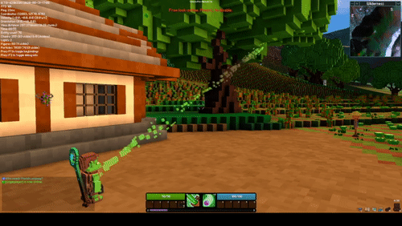
_Healing sceptre with the new particle system_

You can read more about some specific topics from August:

- [Airshipper 0.4.0 Progress](https://veloren.net/devblog-79#airshipper-0-4-progress-by-songtronix)
- [Animation and Movement Updates](https://veloren.net/devblog-79#animation-and-movement-updates-by-slipped)
- [Particle Timing](https://veloren.net/devblog-80#particle-timing-by-lobster)
- [0.7 Release Party Statistics](https://veloren.net/devblog-81#0-7-release-party-statistics)
- [0.7 Release Party Kick Disaster](https://veloren.net/devblog-81#0-7-release-party-kick-disaster-by-xmac94x)
- [Lighting and World Changes](https://veloren.net/devblog-81#sharp-s-lighting-and-world-changes-branch)
- [0.8 Intro Meeting](https://veloren.net/devblog-82#0-8-intro-meeting)
- [Audio SFX](https://veloren.net/devblog-82#audio-with-ellinia)
- [Photo Gallery](https://veloren.net/devblog-83#photo-gallery)

August's full weekly devlogs: "This Week In Veloren...":
[#79](https://veloren.net/devblog-79), [#80](https://veloren.net/devblog-80),
[#81](https://veloren.net/devblog-81), [#82](https://veloren.net/devblog-82).
[#83](https://veloren.net/devblog-83).

In September, work on 0.8 will continue. Some large systems being worked on
include networking, improved persistence stability, and player experience. Game
design is working on improving the connection between the experience a new
player has, and the current game design. The in-progress 0.8 version will likely
be completed more quickly than 0.7, as to not include too many changes.

[veloren]: https://veloren.net
[veloren-interview]: https://rustgamedev.com/episodes/interview-with-team-veloren

### [A/B Street][abstreet]

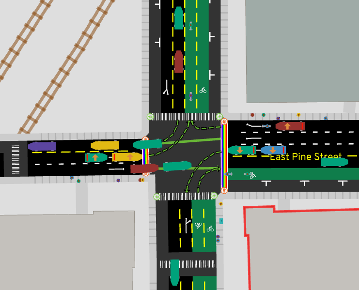

[A/B Street][abstreet] is a traffic simulation game exploring how small changes
to roads affect cyclists, transit users, pedestrians, and drivers. Any city
with OpenStreetMap coverage can be used!

Some of this month's updates:

- Multiple traffic signals can be edited together.
- An [API][abstreet-api] and tools were added, to control maps and simulation
  from any language.
- [Michael Kirk][mkirk], a new team member, fixed HiDPI scaling issues in a
  consistent way.
- Many new cities imported, with better support for countries that drive on the
  left and support for using alternate languages from OpenStreetMap for roads
  and buildings.
- Backwards compatibility for a player's edits to the map.
- Two-way cycletracks and roads with multiple direction changes.

[abstreet]: https://abstreet.org
[abstreet-api]: https://dabreegster.github.io/abstreet/dev/api.html
[mkirk]: https://github.com/michaelkirk

### [Egregoria]


[Egregoria]'s objective is to become a granular society simulation,
filled with fully autonomous agents interacting with their world in real time.
Egregoria was previously known as Scale,
but was renamed to fit the theme better.

The [5th devlog][egregoria-blog-post] was published, talking about
the renaming, project managment, buildings and scripting.

A [Discord][egregoria-discord] server was launched to discuss the project.

_Discussions:
[/r/rust_gamedev](https://reddit.com/r/rust_gamedev/comments/igzbl9/egregoria_devblog_5)_

[Egregoria]: https://github.com/Uriopass/Egregoria
[egregoria-blog-post]: http://douady.paris/blog/egregoria_5.html
[egregoria-discord]: https://discord.gg/CAaZhUJ

### [Cary]

[][Cary]

In [Cary] the player has to bring the titular character to the exit by carying
them or otherwise making sure they don't – nor the player themselves –
touch any of the traps.
Easier said then done when you have limited stamina and Cary keeps running
into spikes.

Made with hecs and wgpu (no framework), but uses WebGL on the web
because of the current implementation status of WebGPU.

Made during the [Extra Credits game jam][extra-credits-jam],
it's a rather small game.
It can be played in the browser or downloaded at [itch.io][Cary].

[Cary]: https://specificprotagonist.itch.io/cary
[extra-credits-jam]: https://itch.io/jam/extra-credits-game-jam-6

### [Way of Rhea]

[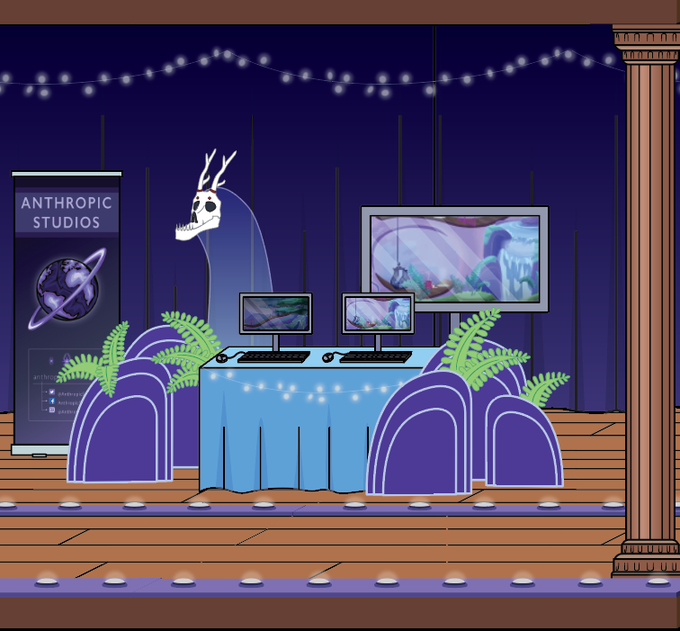][Way of Rhea]
_Anthropic's virtual booth at [Play NYC]_

[Way of Rhea] is a puzzle platformer that takes place in a world where you can
only interact with items that match your current color.

Way of Rhea has a [free Steam demo][Way of Rhea] temporarily available as part of
[Play NYC]!
The new demo includes a level that wasn't part of the Steam Game Festival,
showing off how circuit puzzles will work in the game. Since Play NYC
couldn't be in person this year, the devs temporarily themed this level to look
like last year's Play NYC venue, included placing virtual booths for other games
throughout the level.

Follow [@AnthropicSt] or [@masonremaley] on Twitter or
[sign up for the mailing list][anthropic-newsletter] for updates.

[Way of Rhea]: https://store.steampowered.com/app/1110620/Way_of_Rhea/
[Play NYC]: https://www.play-nyc.com/
[@AnthropicSt]: https://twitter.com/anthropicst
[@masonremaley]: https://twitter.com/masonremaley
[anthropic-newsletter]: https://www.anthropicstudios.com/newsletter/signup/tech

### [vange-rs]


[vange-rs] is the project of re-implementing the [Vangers] game (from 1998)
in Rust using modern development practices, parallel computations, and GPU.

This month vange-rs got real-time shadows!
See [video on /r/rust_gamedev][vangers-shadow-video] and technical description
on the [Hybrid Shadows][vangers-shadow-blog] post of the blog.

Another exciting development - the new bruteforce rendering technique allowing
to shift the camera behind the mechos as in 3rd person view.
See [video on /r/rust_gamedev][vangers-bars-video] and technical description on
the [Bar Painting][vangers-bars-blog] post of the blog.

[Vangers]: https://en.wikipedia.org/wiki/Vangers
[vange-rs]: https://github.com/kvark/vange-rs
[vangers-shadow-video]: https://reddit.com/r/rust_gamedev/comments/i32p6r/realtime_hybrid_shadows_in_vangers
[vangers-shadow-blog]: https://kvark.github.io/vange-rs/2020/08/04/shadows.html
[vangers-bars-video]: https://reddit.com/r/rust_gamedev/comments/igejxy/vangers_3rd_person_camera
[vangers-bars-blog]: https://kvark.github.io/vange-rs/2020/08/29/bar-painting.html

### [Chillscapes][chillscapes-itch]


[Chillscapes][chillscapes-github] is a lo-fi
rhythm experience created for the [NEOC#03 Rhythm Game Jam][neoc]. Using
layerable lo-fi music tracks, the game has you tap with the rhythm of the loops
being added, before changing the music up by adding another loop into the mix.
Last week, [a retrospective update was published][chillscapes-retrospective]
reflecting on what the developer's takeaways were from the experience.

Chillscapes is written using an early-in-development 2d engine,
[Kludgine][kludgine]. For audio playback, rodio was utilized. The source code is
[available on GitHub][chillscapes-github].

[chillscapes-itch]: https://khonsulabs.itch.io/chillscapes
[chillscapes-github]: https://github.com/khonsulabs/chillscapes
[chillscapes-retrospective]: https://community.khonsulabs.com/t/chillscapes-retrospective-and-kludgine-update/28
[neoc]: https://itch.io/jam/neoc03-rhythm-jam
[kludgine]: https://github.com/khonsulabs/kludgine

### [Dwarf Seeks Fortune][dsf-github]

[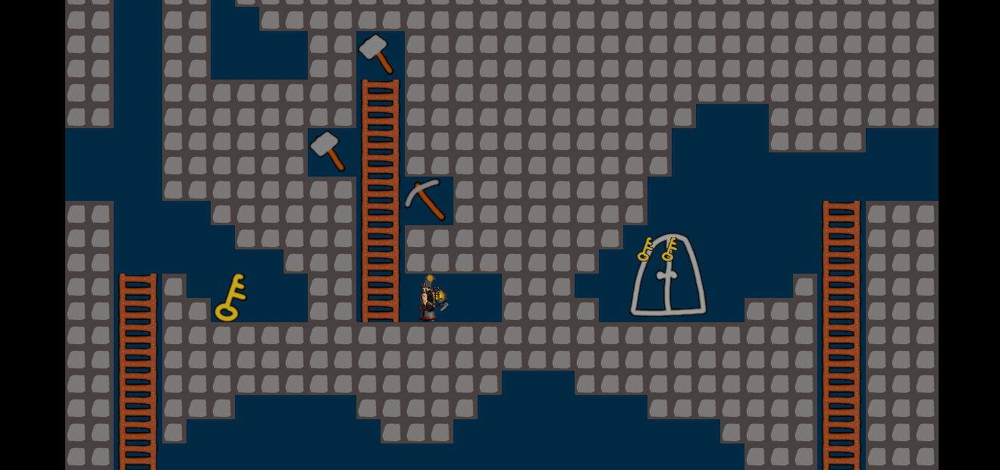][dsf-github]
_Collect all keys to unlock the door to the next level._

[Dwarf Seeks Fortune][dsf-github] is a puzzle-platformer made with the Amethyst game
engine. Its developer, Jazarro, has partnered with the Amethyst organization
to make it an official Amethyst showcase game. It aims to be a learning
resource for anyone looking to get started with Amethyst.

The game currently sports a growing feature set, two playable levels and an
early version of an integrated level editor. It is ready for your
contributions, so if you're interested, check out the
[contributor's guide][dsf-contributing] or the [good first issues][dsf-good-first-issues].
If you have any questions, open an issue on GitHub or approach
Jazarro on [the Amethyst discord][amethyst-discord].

[dsf-github]: https://github.com/amethyst/dwarf_seeks_fortune
[dsf-contributing]: https://github.com/amethyst/dwarf_seeks_fortune/blob/master/CONTRIBUTING.md
[dsf-good-first-issues]: https://github.com/amethyst/dwarf_seeks_fortune/issues?q=is%3Aissue+is%3Aopen+label%3A%22good+first+issue%22
[kv-ii]: https://en.wikipedia.org/wiki/King%27s_Valley_II
[amethyst-discord]: https://discord.com/invite/amethyst

### [Akigi][akigi]

[Akigi][akigi] is a WIP online multiplayer game.

This month was mostly dedicated to the custom engine's scenery placement tool
([video demo](https://devjournal.akigi.com/august-2020/082-2020-08-30.html)).
Some of the updates:

- [Terrain code refactoring and other required groundwork](https://devjournal.akigi.com/august-2020/080-2020-08-16.html).
- [Mouse-terrain intersection](https://devjournal.akigi.com/august-2020/082-2020-08-30.html#mouse-terrain-intersection).
- [Switching between Play and Place modes](https://devjournal.akigi.com/august-2020/082-2020-08-30.html#play-mode-place-mode).
- [Custom UI system](https://devjournal.akigi.com/august-2020/082-2020-08-30.html#user-interfaces).

Full devlogs:
[#078](https://devjournal.akigi.com/august-2020/078-2020-08-02.html),
[#079](https://devjournal.akigi.com/august-2020/079-2020-08-09.html),
[#080](https://devjournal.akigi.com/august-2020/080-2020-08-16.html),
[#081](https://devjournal.akigi.com/august-2020/081-2020-08-23.html),
[#082](https://devjournal.akigi.com/august-2020/082-2020-08-30.html).

[akigi]: https://akigi.com

### [SIMple Physics][simple-physics-site]

[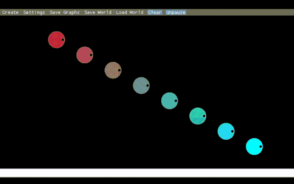][simple-physics-gifs]
_One of SIMple Mechanic's Lua presets, a colorful wave of bouncing circles_

[SIMple Physics][simple-physics-site] by [@mkhan45] is a set of educational physics
simulators meant to help students and teachers conduct labs without expensive equipment
or in person classes. Each simulator uses serializeable graphs, object inspection,
Lua scripting, and a few other features to help students learn. Currently, there
is a simulator for mechanics/projectile motion and one for universal gravitation,
but the goal is to include one for electronics/magnetism and one for waves/optics.

Written in Rust using `ggez`, `specs`, `imgui-rs`, and `nphysics`,
this project's goals include:
performance, accessibility/portability, ease of use, and extensibility.

To find out more about the project, visit the site [here][simple-physics-site],
watch some cool gifs [here][simple-physics-gifs], or read the GitHub page
[here][simple-physics-github].

_Discussions:
[/r/rust](https://reddit.com/r/rust/comments/ibk2rf/announcing_simple_physics)_

[simple-physics-site]: https://mkhan45.github.io/SIMple-Physics/
[simple-physics-gifs]: https://mkhan45.github.io/SIMple-Physics/posts/Gifs/
[simple-physics-github]: https://mkhan45.github.io/SIMple-Physics/posts/Gifs/
[@mkhan45]: https://github.com/mkhan45

## Learning Material Updates

### [Writing NES Emulator in Rust][rust_nes_tutorial]

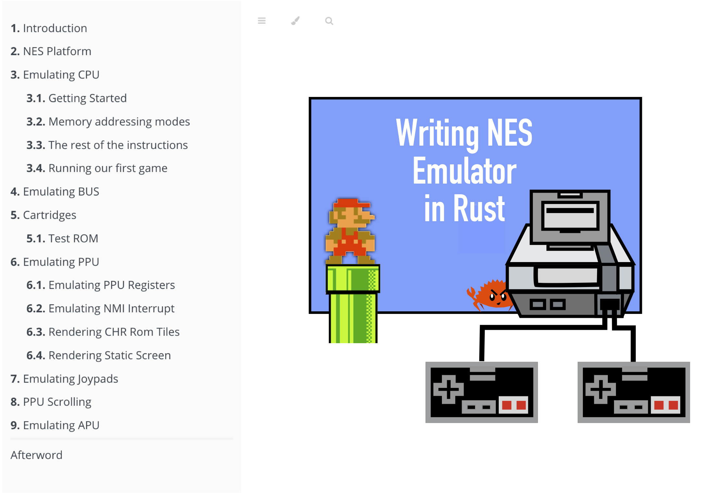

"Writing NES Emulator in Rust" is a tutorial by [@bugzmanov] on creating a fully
capable NES/Famicom emulator from scratch in the online book format. It walks
through major steps of emulating NES platform components to run
all-time classics, like Pacman, Donkey Kong, and Super Mario Bros.

It's a fun way of getting into hardware internals and fundamentals of
computer systems. The tutorial also covers game-dev basics and how to
work with graphics in Rust using [SDL2][sdl2] library.

[rust_nes_tutorial]: https://bugzmanov.github.io/nes_ebook/index.html
[@bugzmanov]: https://twitter.com/bugzmanov
[sdl2]:https://www.libsdl.org/

### [Beginning Game Development with Amethyst][rustconf-talk-video]

[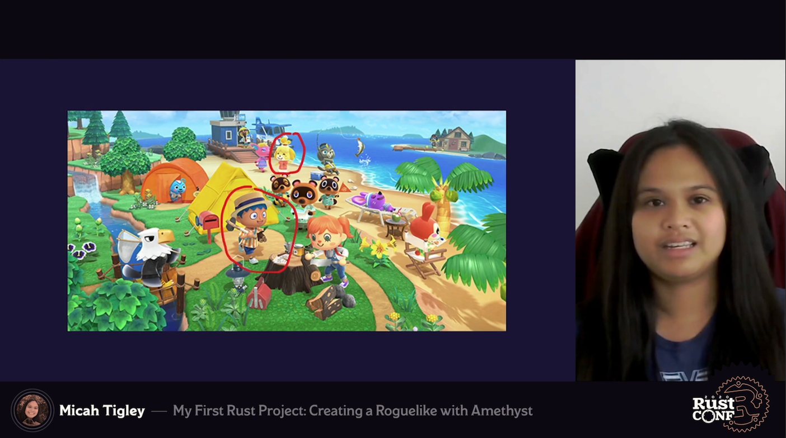][rustconf-talk-video]
_Click to [watch the talk][rustconf-talk-video]._

Getting started with Rust + gamedev can be intimidating. At
[RustConf 2020][rust-conf-2020], [Micah Tigley] gave a talk about their experience
beginning game development using the [Amethyst][amethyst-link] game engine and
learning about ECS by implementing examples that aim to be accessible for
beginners.

Supporting blog posts for talk:

- [Creating a Simple Spritesheet Animation with Amethyst][micah-blog-part1]
- [Running Animation][micah-blog-part2]
- [Camera Follow System][micah-blog-part3]

The source code for the [demo can be found here][micah-demo-src].

[Micah Tigley]: https://twitter.com/micah_tigley
[rustconf-talk-video]: https://www.youtube.com/watch?v=GFi_EdS_s_c
[micah-blog-part1]: https://mtigley.dev/posts/sprite-animations-with-amethyst
[micah-blog-part2]: https://mtigley.dev/posts/running-animation
[micah-blog-part3]: https://mtigley.dev/posts/camera-follow-system
[micah-demo-src]: https://github.com/tigleym/sprite_animations_demo
[amethyst-link]: https://amethyst.rs/
[rust-conf-2020]: https://rustconf.com

### [Chargrid Roguelike Tutorial 2020][chargrid-roguelike-tutorial-2020]


[Chargrid][chargrid] by [@stevebob] is a collection of crates for building
applications with text UIs that run in terminals, graphical windows, and web
pages. It was made specifically with roguelike development in mind, though is
general-purpose enough to be used for other applications.

[Chargrid Roguelike Tutorial 2020][chargrid-roguelike-tutorial-2020]
is a tutorial series about making a traditional roguelike from scratch
using chargrid for rendering and input handling. Reference code is available in
[this git repo][chargrid-roguelike-tutorial-2020-reference-code]
organized with one branch for each subsection.

[chargrid-roguelike-tutorial-2020]: https://gridbugs.org/roguelike-tutorial-2020/
[chargrid-roguelike-tutorial-2020-reference-code]: https://github.com/stevebob/chargrid-roguelike-tutorial-2020
[chargrid]: https://github.com/stevebob/chargrid/
[@stevebob]: https://github.com/stevebob

### [Event Chaining as a Decoupling Method in ECS][event-chaining]


[@jojolepro] released a [blog post][event-chaining] that provides
an in-depth look at how using events in entity-component-system architectures
can improve system reusability dramatically.

Using events in this way also allows for:

- easier testing,
- additional configurability,
- possible performance improvements,
- higher reusability - especially if using generics.

The blog also has an [RSS feed][jojolepro-rss] and more in-depth posts about
game development are planned.

[event-chaining]: https://www.jojolepro.com/blog/2020-08-20_event_chaining/
[jojolepro-rss]: https://www.jojolepro.com/blog/blog.xml
[@jojolepro]: https://github.com/jojolepro

## Library & Tooling Updates

### [ecs_bench_suite]

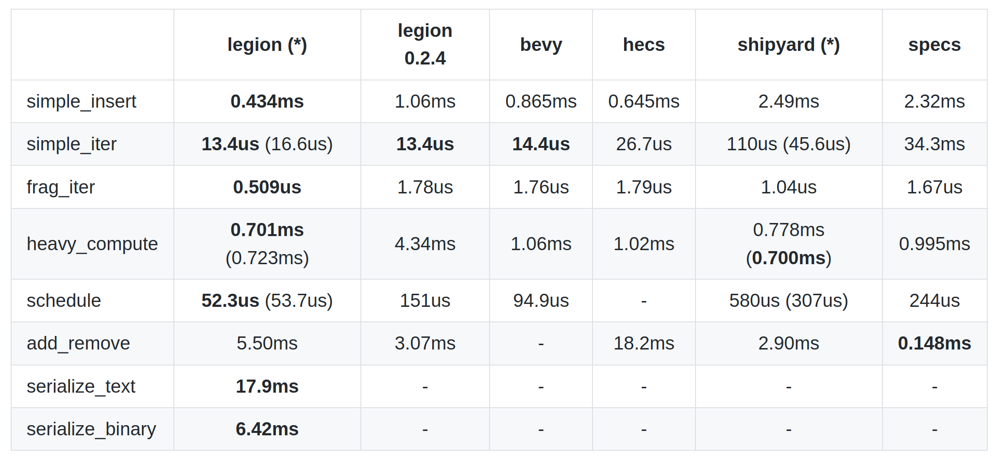
_The full benchmark report is available [here][ecs_report]_

This month [@TomGillen] (author of the [Legion][legion] ECS) released
[ecs_bench_suite] - a suite of benchmarks designed to test and compare
Rust ECS library performance across a variety of challenging circumstances.
Later, the project was adopted by the Rust GameDev WG
so that all Rust ECS developers can converge on a neutral,
community-maintained benchmark.

_Discussions:
[/r/rust](https://reddit.com/r/rust/comments/icczxh/ecs_bench_suite)_

[ecs_bench_suite]: https://github.com/rust-gamedev/ecs_bench_suite
[@TomGillen]: https://github.com/TomGillen
[legion]: https://github.com/amethyst/legion
[ecs_report]: https://rust-gamedev.github.io/ecs_bench_suite/target/criterion/report/index.html

### [Rapier: 2D and 3D Physics Engines Focused on Performance][rapier-august]

[][Rapier]

[Rapier] is a new set of 2D and 3D physics engines written 100% in Rust.
It is 5 to 10 times faster than [nphysics], close to the performances of the
CPU version of PhysX, and often slightly faster than Box2D.

[For its first release][rapier-august] Rapier includes:

- rigid-body dynamics;
- colliders and sensors;
- joint constraints;
- optional serialization of the physics state;
- optional cross-platform determinism on IEEE-754 compliant targets;
- optional explicit SIMD and parallelism.
- JavaScript bindings with official NPM packages.

This new physics engine is developed by the recently created [Dimforge]
single-member Open-Source company [replacing][dimforge-replace] the former
Rustsim organization created on GitHub by [@sebcrozet].

_Discussions:
[/r/rust](https://www.reddit.com/r/rust/comments/igkul2/announcing_rapier_2d_and_3d_physics_engines/)_

[Rapier]: https://rapier.rs
[rapier-august]: https://www.dimforge.com/blog/2020/08/25/announcing-the-rapier-physics-engine
[dimforge-replace]: https://www.dimforge.com/blog/2020/08/18/rustsim-becomes-dimforge
[Dimforge]: https://dimforge.com
[@sebcrozet]: https://github.com/sebcrozet/
[nphysics]: https://nphysics.org

### [NeoCogi's Libraries][neocogi-repo]


[Jude3D](https://neocogi.com) is a web based 3D sculpting application.
It's a WebAssembly application, written in C/C++ and compiled using Emscripten
but after much thinking the authors decided to move the development to Rust!

Many problems arise when moving existing C/C++/WebAssembly code to Rust.
The two most important ones:

- The new code should still interop with the already existing code.
- Payload size matters on the web: your WASM app should be as small as possible.

These led the authors to drop using Rust's std in favor to their own libs (`!#[no_std]`),
at least until the std library crates are split up accordingly and stabilized,
for example the `alloc` crate.

The good news is that they are
[releasing most of the libraries as they make them as open source][neocogi-repo]!
Also, a [WASM glfw3/GLES2 example][neocogi-example-src] that showcases the libs
is included ([live demo][neocogi-example-demo]).

[Jude3D in action]: https://twitter.com/weloraiby/status/1167228654922928130
[neocogi-repo]: https://github.com/NeoCogi
[neocogi-example-src]: https://github.com/NeoCogi/rs-glfw3-gles2-test
[neocogi-example-demo]: https://neocogi.github.io/rs-glfw3-gles2-test

### [cute-c2]


cute-c2 is a 2D collision detection library that has had its first release to
[crates.io][cute-c2]. The library is a Rust wrapper around the [c2.h] library.

The library can detect collisions between circles, rectangles, capsules and
up to eight-sided convex polygons. There are also functions for manifold
generation, the GJK algorithm and ray casting operations. There is an example
program in the repository.

[cute-c2]: https://crates.io/crates/c2
[c2.h]: https://github.com/RandyGaul/cute_headers/blob/master/cute_c2.h

### [hexasphere] v1.0


The [hexasphere] library provides a customizable interface for subdividing 3D
triangle meshes. Custom and stateful interpolation functions can be implemented
as well as per-vertex attributes.

All that's required to define a base shape are the initial vertices, triangles
based on the indices of the vertices in the initial vertices, and numbered
edges. As long as the winding of the triangles remains consistend throughout
the base mesh, all of the resulting triangles will retain that winding.

This library also provides a few interesting base shapes (which can be used alone
if the shape is not subdivided):
Icosahedron, Tetrahedron, Cube, Square Plane, Triangle Plane
(all of which are pictured above).

[hexasphere]: https://crates.io/crates/hexasphere

### [blitz-path](https://github.com/BezPowell/blitz-path)

[blitz-path](https://github.com/BezPowell/blitz-path) is a new crate providing
an implementation of the [JPS](https://en.wikipedia.org/wiki/Jump_point_search)
pathfinding algorithm.

JPS is an optimization of the A* search algorithm for uniform-cost grids, which
are common in games. While fully functional, the code is still in an early
state and any suggestions for improvements - especially on how best to
integrate it with the existing ecosystem - are greatly appreciated.

### [This Month in Mun][mun-august]

[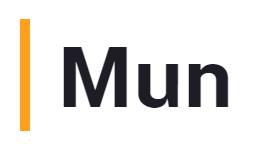][Mun]

[Mun] is a scripting language for gamedev focused on quick iteration times
that is written in Rust.

[August updates][mun-august] include:

- compiler support for type aliases;
- shared diagnostics between compiler and language server;
- support for the official [inkwell][mun-inkwell] crate;
- refactors and quality of life improvements.

[Mun]: https://mun-lang.org
[mun-august]: https://mun-lang.org/blog/2020/08/30/this-month-august/
[mun-inkwell]: https://crates.io/crates/inkwell

### [inline_tweak]

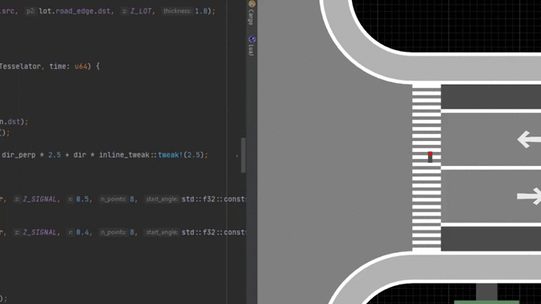

[inline_tweak] by [@Uriopass] is a library that allows you to
tweak at runtime any number literal directly from your code.
It works by parsing the file when a change occurs
(inspired by [this blogpost][tuxedolabs-post] from Tuxedo labs).
Usage example:

```rust
use inline_tweak::tweak;
loop {
    // Try changing the value while the application is running
    println!("{}", tweak!(3.14));
}
```

A `watch!()` macro that sleeps until the file is modified is also provided.

The library is minimal, only requiring the `lazy_static` dependency
to hold modified values.
In release mode, the tweaking code is disabled and compiled away.

[inline_tweak]: https://crates.io/crates/inline_tweak
[@Uriopass]: https://github.com/Uriopass
[tuxedolabs-post]: http://blog.tuxedolabs.com/2018/03/13/hot-reloading-hardcoded-parameters.html

### [yacurses]

[yacurses] by [@Lokathor] is a cross-platform curses bindings crate that's
small, simple, easy to understand, and most importantly safe to use.
It wraps over `ncurses` on Unix and a bundled `pdcurses` on Windows.
If you're looking to make a terminal-based roguelike
(or any other terminal-based game), give it a try.

[yacurses]:https://lib.rs/crates/yacurses
[@Lokathor]: https://github.com/Lokathor

### [SPIR-Q] v0.4.6

[SPIR-Q] is a light-weight shader reflection library, which allows you to query
the types, offsets, sizes and even names in your shaders procedurally.

This month v0.4.2..v0.4.6 versions were released.
Some of the updates:

- Specialization constants enumeration.
- Dynamically sized multi-binding support.
- Improved entrypoint debug printing.
- Better manifest merging method for pipeline construction.
- Bugfixes and various small API improvments.

_Discussions: [/r/rust_gamedev][spirq-discussion]_

[SPIR-Q]: https://github.com/PENGUINLIONG/spirq-rs
[spirq-discussion]: https://reddit.com/r/rust_gamedev/comments/i6hxh6/spirq_042

### [Inline SPIR-V]

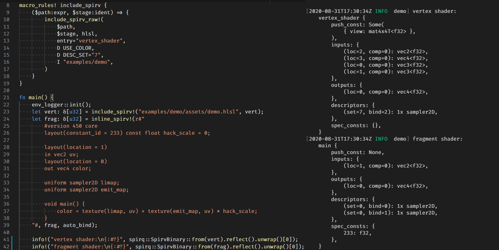

[Inline SPIR-V] is a single-crate build-time shader compilation library based on
shaderc which provides procedural macros to help you translate shader sources,
in either GLSL or HLSL, inline or from-file, into SPIR-Vs and embed the SPIR-Vs
right inside your code as `u32` slices. Despite basic shader compilation,
`inline-spirv` also support `#include` directives, macro substitution,
post-compile optimization, as well as descriptor auto-binding.

_Discussions: [/r/rust_gamedev][inline-spirv-discussion]_

[Inline SPIR-V]: https://github.com/PENGUINLIONG/inline-spirv-rs
[inline-spirv-discussion]: https://reddit.com/r/rust_gamedev/comments/ic1005/inline_spirv

### [rspirv-reflect] v0.1


[Traverse Research] has created the [rspirv-reflect] library to replace
their very basic use-case of the existing [spirv-reflect-rs] / [spirv-reflect]
libraries that are already out there. The current iteration of `rspirv-reflect`
is pretty minimal, but it allows you to extract the binding setup from a SPIR-V
binary. `rspirv-reflect` supports the latest version of SPIR-V (version 1.5 as
of writing) and it also supports all the new shader stages (both ray tracing
and mesh/task shaders) as well as the existing ones.

Traverse Research wanted to reduce their reliance on C and C++ unsafe
libraries and at the same time they needed to support newer features that were
slow to become available in the existing `spirv-reflect` library. The primary
use-case for this library is in conjecture with the Rust wrapper around the
DirectX Shader Compiler ([dxc]), called [hassle-rs] that Traverse Research
also built.

[Traverse Research]: https://traverseresearch.nl
[rspirv-reflect]: https://github.com/Traverse-Research/rspirv-reflect
[spirv-reflect]: https://github.com/KhronosGroup/SPIRV-Reflect
[spirv-reflect-rs]: https://github.com/gwihlidal/spirv-reflect-rs
[hassle-rs]: https://github.com/Traverse-Research/hassle-rs
[dxc]: https://github.com/microsoft/DirectXShaderCompiler

### [gfx-rs][gfx-repo] and [wgpu][wgpu-site]

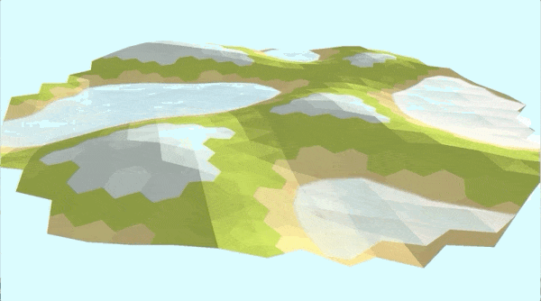
_wgpu-rs's [water example][wgpu-water]_

gfx-rs project and wgpu ecosystem have observed the release of 0.6 versions! 🎉

Some of the updates:

- Reworked project structure:
  - `wgpu-core` - a safe pure-Rust internal API, implementing WebGPU specification;
  - `wgpu-rs` - the idiomatic Rust wrapper;
  - `wgpu-native` - the C API wrapper, aiming to be compatible with [Dawn];
  - Gecko and Servo - for implementing WebGPU API in the browsers.
- Ability to record API traces, replay them on a different machine,
  and run data-driven tests.
- `write_buffer` and `write_texture` for update the GPU data
  without intermediate staging buffers or encoders.
- A number of powerful native-only extensions, such as descriptor indexing,
  as well as web-compatible extensions like depth-clamping.
- [naga] v0.2 - an experimental shader translation library.
- The [showcase gallery](https://wgpu.rs/#showcase) was updated.

Read about the details on [gfx-rs blog](https://gfx-rs.github.io/2020/08/18/release-0.6.html).

[@sothr](https://github.com/sothr) has reworked the
[wgpu instancing tutorial][wgpu-instancing-tutor].
See discussion at [/r/rust_gamedev][wgpu-instancing-reddit].

[gfx-repo]: https://github.com/gfx-rs/gfx
[wgpu-site]: https://wgpu.rs
[wgpu-water]: https://github.com/gfx-rs/wgpu-rs/tree/master/examples/water
[wgpu-instancing-tutor]: https://sotrh.github.io/learn-wgpu/beginner/tutorial7-instancing/#the-instance-buffer
[wgpu-instancing-reddit]: https://reddit.com/r/rust_gamedev/comments/i8np5v/simplified_instancing_tutorial_learn_wgpu
[naga]: https://github.com/gfx-rs/naga
[Dawn]: https://dawn.googlesource.com/dawn

### [KAS] v0.5 and [KAS-text] v0.1


[KAS] by [@dhardy] is a general purpose UI toolkit; its
initial aim is "old school" desktop apps with good keyboard and touchscreen
support. Unlike many modern immediate-mode UIs, KAS's widgets retain state,
allowing minimal per-frame updates. KAS supports embedded WebGPU graphics now,
and will (eventually) support being embedded within other contexts (requiring
only a supply of input events and implemention of some basic graphics routines).

KAS v0.5 switches to a new crate for text layout,
[KAS-text]. KAS-text is a text layout
engine supporting multi-line editing, shaping and bidirectional text; future
versions will also support formatting. KAS-text is not tied to any particular
raster or render system; its positioned-glyph output is relatively easy to
adapt to crates like `wgpu_glyph` and `gfx_glyph`.
For more, see the article ["Why I created KAS-text"][kas-article].

[KAS]: https://github.com/kas-gui/kas
[KAS-text]: https://github.com/kas-gui/kas-text
[kas-article]: https://kas-gui.github.io/blog/why-kas-text.html
[@dhardy]: https://github.com/dhardy

### [Egui]

[Egui] is a highly portable immediate mode GUI library in pure Rust.
Egui can be integrated anywhere you can paint textured triangles.
You can compile Egui to WASM and render it on a web page using [egui_web]
or compile and run natively using [egui_glium].

[Click to run Egui web demo](https://emilk.github.io/egui/index.html)

Example:

```rust
Window::new("Debug").show(ui.ctx(), |ui| {
    ui.label(format!("Hello, world {}", 123));
    if ui.button("Save").clicked {
        my_save_function();
    }
    ui.text_edit(&mut my_string);
    ui.add(Slider::f32(&mut value, 0.0..=1.0).text("float"));
});
```

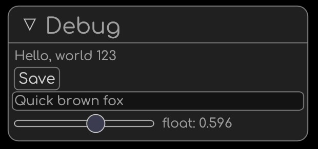

_Discussions:
[/r/rust](https://reddit.com/r/rust/comments/hzwvsk/emigui_deserves_more_love)_

[Egui]: https://github.com/emilk/egui/
[egui_glium]: https://crates.io/crates/egui_glium
[egui_web]: https://crates.io/crates/egui_web

### [voxel-mapper]

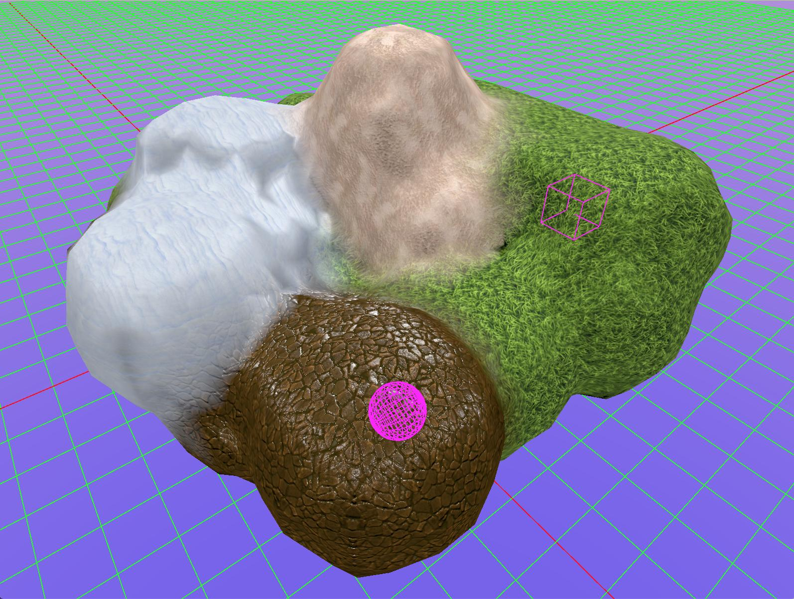

[voxel-mapper] is a library and in-game editor for voxel maps, smooth or cubey.
The ultimate goal of the project is to make it easy for artists and programmers
alike to generate volumetric game content, either manually or procedurally.
The library's author [@bonsairobo] has also written a couple posts:

- ["Smooth Voxel Mapping: a Technical Deep Dive on Real-time Surface Nets and Texturing"][voxel-post-tech]
- ["A 3rd Person Camera in a Complex Voxel World"][voxel-post-cam]

Upcoming on the roadmap are procedural generation algorithms for generating
maps, new kinds of voxels, and graphical improvements. Currently, the library
and editor depend on the Amethyst engine version 0.15, but there is a desire to
make the library engine-agnostic. Contributions are welcome!

[voxel-mapper]: https://github.com/amethyst/voxel-mapper
[@bonsairobo]: https://github.com/bonsairobo
[voxel-post-tech]: https://medium.com/@bonsairobo/smooth-voxel-mapping-a-technical-deep-dive-on-real-time-surface-nets-and-texturing-ef06d0f8ca14
[voxel-post-cam]: https://medium.com/@bonsairobo/a-3rd-person-camera-in-complex-voxel-world-523944d5335c

### [Bevy Engine][bevy]

[](https://bevyengine.org/)

[Bevy][bevy] by [@cart] is a brand new, refreshingly simple data-driven
game engine built in Rust. It aims to be:

- **Capable**: Offer a complete 2D and 3D feature set.
- **Simple**: Easy for newbies to pick up, but infinitely flexible
  for power users.
- **Data Focused**: Data-oriented architecture using
  the Entity Component System paradigm.
- **Modular**: Use only what you need. Replace what you don't like.
- **Fast**: App logic should run quickly, and when possible, in parallel.
- **Productive**: Changes should compile quickly ... waiting isn't fun.

These last few weeks have been big for the Bevy project:

- Bevy was announced and [open sourced on GitHub][bevy].
- Bevy's features were introduced in the ["Introducing Bevy"][bevy-intro]
  blog post.
- Had a staggering number of people join the community.
  This required some quick planning to handle the new size,
  which they outlined in the [Scaling Bevy][bevy-scaling] blog post.
- Added an official [awesome-bevy repo][awesome-bevy]
  with a huge number of community plugins, games, apps, and learning materials.
- Rapier, a new pure-rust physics engine,
  released an [official Bevy plugin][bevy-rapier].
- Thanks to the generosity of individuals and companies, they quickly met
  their first two funding goals on @cart's [Github Sponsors page][bevy-spnsors]:
  "sustainable development" and "@cart makes minimum wage working on Bevy".
- Bevy received a glowing review from the Amethyst Engine team and they agreed
  to collaborate in certain areas.
  See the [Addressing the Elephant in the Room][bevy-amethyst]
  thread on the Amethyst forum for more details.

Bevy users started sharing their work
on the [Bevy Discord showcase channel][bevy-discord-showcase]:

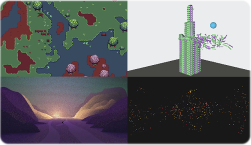

In addition to the initial Bevy GitHub release, 114 pull requests
were merged this month. Some highlights:

- A custom [async task system for Bevy][bevy-pr-async],
  which significantly improves CPU usage and paves the way for future async work.
- Refactored data-driven ECS shader code to make it more maintainable, fix some bugs,
  and ready to be optimized via the ECS change detection apis.
- Support for "logical or" ECS queries as a compliment to the default "logical and".
- Numerous CI improvements.
- Use shaderc to compile shaders for iOS builds.
- GLTF loading improvements.

Bevy also made good progress on its three focus areas:

- [Editor-Ready UI](https://github.com/bevyengine/bevy/issues/254)
- [Physically Based Rendering (PBR)](https://github.com/bevyengine/bevy/issues/179)
- [Scenes](https://github.com/bevyengine/bevy/issues/255)

_Discussions:
[/r/rust](https://reddit.com/r/rust/comments/i7bcwu/introducing_bevy),
[hacker news](https://news.ycombinator.com/item?id=24123283),
[twitter](https://twitter.com/cart_cart/status/1292903435155599361),
[amethyst forum](https://community.amethyst.rs/t/bevy-engine-addressing-the-elephant-in-the-room)_

[bevy]: https://bevyengine.org
[@cart]: https://github.com/cart
[bevy-intro]: https://bevyengine.org/news/introducing-bevy
[bevy-scaling]: https://bevyengine.org/news/scaling-bevy
[awesome-bevy]: https://github.com/bevyengine/awesome-bevy
[bevy-rapier]: https://www.dimforge.com/blog/2020/08/25/announcing-the-rapier-physics-engine/#reaching-out-to-other-communities-bevy-and-javascript
[bevy-spnsors]: https://github.com/sponsors/cart
[bevy-amethyst]: https://community.amethyst.rs/t/bevy-engine-addressing-the-elephant-in-the-room
[bevy-discord-showcase]: https://discord.com/channels/691052431525675048/692648638823923732
[bevy-pr-async]: https://github.com/bevyengine/bevy/pull/384

### [Minigene][minigene]

[Minigene][minigene] is a tiled and ASCII game engine made by [@jojolepro].
It allows to very simply create complex games running on desktop as well as
in the browser.

While it is still under heavy development, a lot can be done already:

- Easily create ECS systems.
- Create tiled and ASCII entities.
- Create GUI elements.
- Move entities around with A\* pathfinding.
- and much more!

[minigene]: https://www.github.com/jojolepro/minigene

### Tetra

[Tetra] is a simple 2D game framework, inspired by XNA and Raylib. This month,
versions [0.4.1][tetra-041] and [0.4.2][tetra-042] were released, featuring:

- Improved Serde support
- Various fixes and improvements to the built-in `Camera` type
- Many documentation improvements, based on user feedback

In addition, Tetra 0.5 is planned for release in early September. For more
information on the upcoming changes, see the [changelog][tetra-changelog].

[tetra]: https://github.com/17cupsofcoffee/tetra
[tetra-041]: https://twitter.com/17cupsofcoffee/status/1289857217198317568
[tetra-042]: https://twitter.com/17cupsofcoffee/status/1294316642680426497
[tetra-changelog]: https://github.com/17cupsofcoffee/tetra/blob/main/CHANGELOG.md

### [Piston]

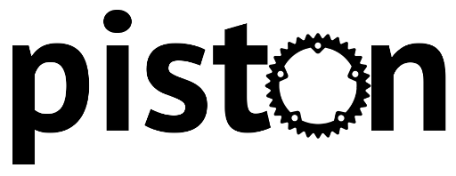

[Piston] is a modular game engine written in Rust.

A new [Piston Discord Channel] has been set up
for the Piston project.

Piston consists of a core library "piston" which itself are composed of
smaller libraries for abstracting input, window and event loop.
This design helps reducing breaking changes in the ecosystem.

The core library `pistoncore-input` is now stabilized and reached 1.0!
This is the most important core abstraction, because it glues all
libraries that are not independent of the core.

[Piston]: https://github.com/pistondevelopers/piston
[Piston Discord Channel]: https://discord.gg/TkDnS9x

------

[Dyon] is a rusty dynamically typed scripting language.
It is developed and maintained as part of the Piston project,
but can be used as a standalone library.

Dyon is designed from the bottom up to be a good gamedev scripting language for Rust.
It uses a lifetime checker instead of garbage collection, a mutability checker,
optional namespaces and ad-hoc types, named argument syntax,
4D vectors and HTML colors, plus a lot more features!

Recently, Dyon got better macro integration for native Rust types
using `#` as a prefix.
Here is an example of this feature is being tested in
an experimental offline 3D renderer (not open sourced):

```text
// Called by `set_simple(scene: _, sdf: _, id: _)`.
dyon_fn!{fn set_simple__scene_sdf_id(
    scene: #&mut SimpleScene,
    sdf: #&Sdf,
    id: f64
) {
    scene.sdfs[id as usize] = sdf.clone()
}}
```

To follow updates on Dyon, check out the subreddit [/r/dyon].

[Dyon]: https://github.com/pistondevelopers/dyon
[/r/dyon]: https://reddit.com/r/dyon/

------

[Piston-Graphics] is a library for 2D graphics, written in Rust,
that works with multiple backends.

`Stencil::Increment` has been added and the ecosystem
has been updated to the latest version.

[Piston-Graphics]: https://github.com/pistondevelopers/graphics

------

The research branch of the Piston project, AdvancedResearch,
has released a new ECS library [Nano-ECS].

This ECS design stores all components in a single array
and uses bit masks for enabling/disabling components.
An entity can have maximum 64 components and must be initalized
with all components it uses in the future.
Each entity has a slice into the array that stores all components.
The `World` object, `Component` and systems are generated using macros.

One research project with Nano-ECS is to prototype a UI framework
for Rust with a UI editor (not open sourced yet).
This project uses Piston-Graphics by default,
but can generate draw commands for processing by other 2D APIs.
It is also possible to override rendering of widgets for
custom looks with Piston-Graphics, which is often useful in gamedev.
Recently, this project has gotten to a place where
[tree-view interaction] is working.

You can follow development at [@PistonDeveloper at Twitter].

[@PistonDeveloper at Twitter]: https://twitter.com/PistonDeveloper
[tree-view interaction]: https://twitter.com/PistonDeveloper/status/1299840279374110720
[Nano-ECS]: https://github.com/advancedresearch/nano_ecs

### [Amethyst v0.15.1][amethyst-v0-15-1-post]


[Amethyst][amethyst] is a game engine and tool-set
for ambitious game developers.

This month a [v0.15.1 version was released][amethyst-v0-15-1-post].
Updates include:

- New book chapters for [UI][amethyst-ui] and [Tiles][amethyst-tiles];
- [Updated examples][amethyst-examples], with special attention to the pong example;
- Switch to [GitHub Actions for CI][amethyst-ga];
- Lots of API improvements and bug fixes.

For more details see the [full changelog][amethyst-changelog].

v0.16 plans include a full migration to the [Legion ECS][legion]
and a big site face lift.

_Discussions:
[/r/rust](https://reddit.com/r/rust/comments/ibvheq/amethyst_engine_v0151)_

[amethyst]: https://amethyst.rs
[amethyst-v0-15-1-post]: https://amethyst.rs/posts/release-0.15.1
[amethyst-examples]: https://github.com/amethyst/amethyst/tree/v0.15.1/examples
[amethyst-ui]: https://book.amethyst.rs/stable/ui.html
[amethyst-tiles]: https://book.amethyst.rs/stable/tiles.html
[amethyst-ga]: https://github.com/amethyst/amethyst/blob/v0.15.1/.github/workflows/ci.yml
[amethyst-changelog]: https://github.com/amethyst/amethyst/blob/master/docs/CHANGELOG.md#0151---2020-08-14

### [starframe]


[starframe] by [@moletrooper] is a work-in-progress 2D game engine
for physics-y sidescrolling games. This month it received
[an experimental graph-based entity system][sf-graph-post].

The next area of focus is going to be fleshing out the physics with
generalized constraints, which will enable things like friction and joints.

_Discussions:
[/r/rust](https://www.reddit.com/r/rust/comments/iju3xq/starframe_devlog_architecture_ecs_graph/),
[twitter](https://twitter.com/moletrooper/status/1300034941816897542)_

[starframe]: https://github.com/moletrooper/starframe
[@moletrooper]: https://twitter.com/moletrooper
[sf-graph-post]: https://moletrooper.github.io/blog/2020/08/starframe-1-architecture/

### [mochi]


[mochi] by [@richardanaya] is a game engine oriented toward
low-power mobile Linux phones/tablets.
It's written in Rust and uses Gtk and Cairo.
All drawing is done with an [Cairo Context][cairo-context] that mochi
has extended to do some really [common graphics operations][mochi-cairo].

This project is super alpha but usable.
Current features include: touch, screen rotation, atlases, sounds.

[pinephone-cairo-game-starter][mochi-start] is a starter for creating
a Cairo-based game in Rust for [PinePhone][pinephone-wiki]

_Discussions:
[/r/rust_gamedev](https://reddit.com/r/rust_gamedev/comments/i2389n/how_to_build_a_pinephone_game_using_rust)_

[mochi]: https://github.com/richardanaya/mochi
[@richardanaya]: https://github.com/richardanaya
[pinephone-wiki]: https://en.wikipedia.org/wiki/PinePhone
[mochi-start]: https://github.com/richardanaya/pinephone-cairo-game-starter
[cairo-context]: https://gtk-rs.org/docs/cairo/struct.Context.html
[mochi-cairo]: https://docs.rs/mochi/latest/mochi/trait.MochiCairoExt.html

### 🐦 [Puffin] Profiler

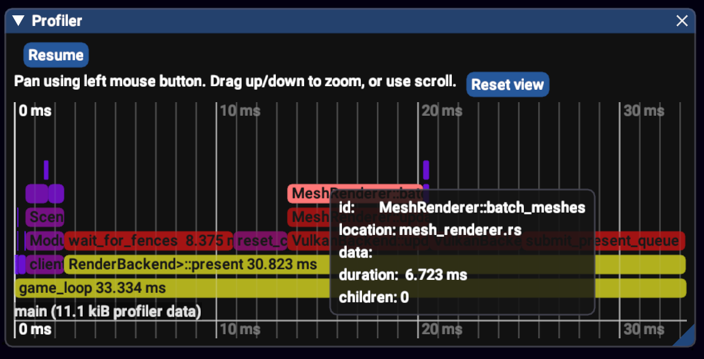

[Puffin] is a simple instrumentation profiler created by [Embark]
where you can opt-in to profile parts of your code.

```rust
fn my_function() {
    puffin::profile_function!():
    ...
    if ... {
        puffin::profile_scope_data!("load_image", image_name):
        ...
    }
}
```

The collected profile data can be viewed ingame with [imgui-rs].

[Puffin]: https://github.com/EmbarkStudios/puffin
[Embark]: https://www.embark-studios.com/
[imgui-rs]: https://github.com/Gekkio/imgui-rs

### [Optick][optick] Profiler

[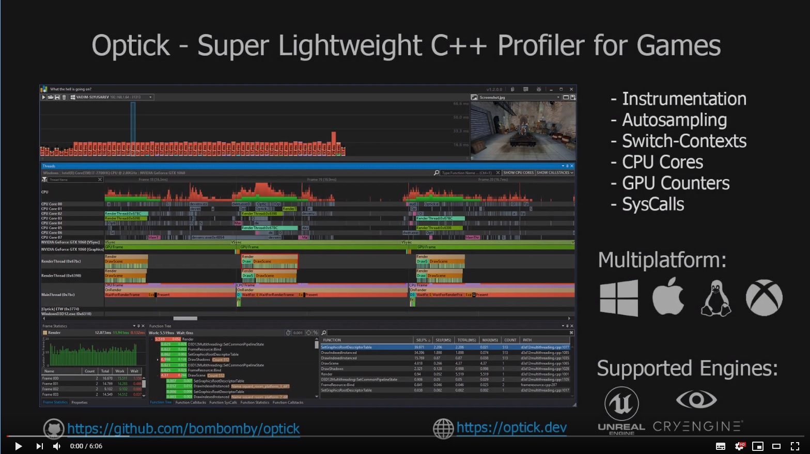][optic-video]
_Click to watch a [video tutorial / features overview][optic-video]_

[Optick][optick] by [@bombomby] is a lightweight C++ profiler for games
that provides access for all the necessary tools required for
efficient performance analysis and optimization:
instrumentation, switch-contexts, sampling, GPU counters.

This month Rust API for Optick was released: [optick-rs].

Also, a set of procedural macros for simplifying the process of code markup
were published: [optick-attr].

```rust
// Instrument current function
#[optick_attr::profile]
fn calc() { /* Do some stuff*/ }

// Generate performance capture for function
// to {dir}/capture_name(date-time).opt.
#[optick_attr::capture("capture_name")]
pub fn main() {
    calc();
}
```

[optick]: https://optick.dev/
[optick-rs]: https://github.com/bombomby/optick-rs
[optick-attr]: https://crates.io/crates/optick-attr
[optic-video]: https://youtube.com/watch?v=p57TV5342fo
[@bombomby]: https://github.com/bombomby

### [wowAddonManager] v1.0.2


The [wowAddonManager] is a terminal user interface for managing World of
Warcraft addons on Linux made by [@mreimsbach]. It allows installing addons
from [Curseforge] for WoW Classic as well as WoW Retail.

The [tui-rs] library was used to create the interface and [Termion] was used to
communicate with the TTY.

[wowAddonManager]: https://github.com/MR2011/wowAddonManager
[@mreimsbach]: https://twitter.com/mreimsbach
[Curseforge]: https://www.curseforge.com/wow/addons
[tui-rs]: https://github.com/fdehau/tui-rs
[Termion]: https://gitlab.redox-os.org/redox-os/termion

### [intellij-ron]

[RON][ron] (Rusty Object Notation) is a simple readable data serialization format
that looks similar to Rust syntax and is designed
to support all of [Serde's data model][serde-data].
RON is relatively popular amongst Rust game developers.

This month [@JonahHenriksson] released [intellij-ron] - a new plugin
that adds [RON][ron]  support to IntelliJ-based IDEs.

_Discussions:
[/r/rust](https://reddit.com/r/rust/comments/ictnsc/ive_created_an_free_open_source_intellij_plugin)_

[intellij-ron]: https://github.com/ron-rs/intellij-ron
[@JonahHenriksson]: https://github.com/JonahHenriksson
[ron]: https://github.com/ron-rs/ron
[serde-data]: https://serde.rs/data-model.html

### [".sia" Parser & Viewer][football-manager]

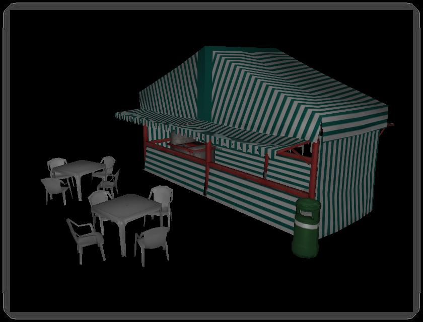

This month [@Stromberg90] published [Football Manager Tools] - a set of tools
for working with [Football Manager's][football-manager] 3D mesh format(.sia).
Amongst them:

- `sia_parser` - a Rust crate for parsing .sia files.
- `sia_viewer` - a standalone Mesh(.sia) Viewer.

[@Stromberg90]: https://github.com/Stromberg90
[football-manager]: https://en.wikipedia.org/wiki/Football_Manager
[Football Manager Tools]: https://github.com/Stromberg90/football-manager-tools

## Popular Workgroup Issues in Github

## Meeting Minutes

<!-- Up to 10 most important notes + a link to the full details -->

[See all meeting issues][label-meeting] including full text notes
or [join the next meeting][join].

[label-meeting]: https://github.com/rust-gamedev/wg/issues?q=label%3Ameeting

## Requests for Contribution

<!-- Links to "good first issue"-labels or direct links to specific tasks -->

- [Embark's open issues][embark-open-issues] ([embark.rs]).
- [winit's "Good first issue" and “help wanted” issues][winit-issues].
- [gfx-rs's "contributor-friendly" issues][gfx-issues].
- [wgpu's "help wanted" issues][wgpu-help-wanted].
- [luminance's "low hanging fruit" issues][luminance-fruits].
- [ggez's "good first issue" issues][ggez-issues].
- [Veloren's "beginner" issues][veloren-beginner].
- [Amethyst's "good first issue" issues][amethyst-issues].
- [A/B Street's "good first issue" issues][abstreet-issues].
- [Mun's "good first issue" issues][mun-issues].
- [SIMple Mechanic's good first issues][simm-issues].
- [Bevy's "good first issue" issues][bevy-issues].

[embark.rs]: https://embark.rs
[embark-open-issues]: https://github.com/search?q=user:EmbarkStudios+state:open
[winit-issues]: https://github.com/rust-windowing/winit/issues?utf8=✓&q=is%3Aissue+is%3Aopen+label%3A%22status%3A+help+wanted%22+label%3A%22Good+first+issue%22
[gfx-issues]: https://github.com/gfx-rs/gfx/issues?q=is%3Aissue+is%3Aopen+label%3Acontributor-friendly
[wgpu-help-wanted]: https://github.com/gfx-rs/wgpu-rs/issues?q=is%3Aissue+is%3Aopen+label%3A%22help+wanted%22
[luminance-fruits]: https://github.com/phaazon/luminance-rs/issues?q=is%3Aissue+is%3Aopen+label%3A%22low+hanging+fruit%22
[ggez-issues]: https://github.com/ggez/ggez/labels/%2AGOOD%20FIRST%20ISSUE%2A
[veloren-beginner]: https://gitlab.com/veloren/veloren/issues?label_name=beginner
[amethyst-issues]: https://github.com/amethyst/amethyst/issues?q=is%3Aissue+is%3Aopen+label%3A%22good+first+issue%22
[abstreet-issues]: https://github.com/dabreegster/abstreet/issues?q=is%3Aissue+is%3Aopen+label%3A%22good+first+issue%22
[mun-issues]: https://github.com/mun-lang/mun/labels/good%20first%20issue
[simm-issues]: https://github.com/mkhan45/SIMple-Mechanics/labels/good%20first%20issue
[bevy-issues]: https://github.com/bevyengine/bevy/labels/good%20first%20issue

## Jobs

<!-- An optional section for new jobs related to Rust gamedev -->

## Bonus

<!-- Bonus section to make the newsletter more interesting
and highlight events from the past. -->

Just an interesting Rust gamedev link from the past. :)

------

That's all news for today, thanks for reading!

Subscribe to [@rust_gamedev on Twitter][@rust_gamedev]
or [/r/rust_gamedev subreddit][/r/rust_gamedev] if you want to receive fresh news!

<!--
TODO: Add real links and un-comment once this post is published
**Discussions of this post**:
[/r/rust](TODO),
[twitter](TODO).
-->

[/r/rust_gamedev]: https://reddit.com/r/rust_gamedev
[@rust_gamedev]: https://twitter.com/rust_gamedev
