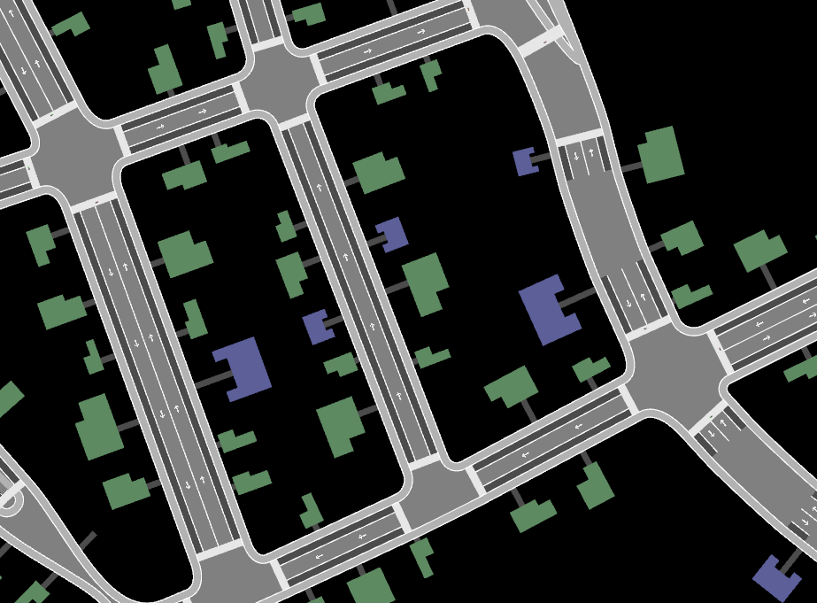
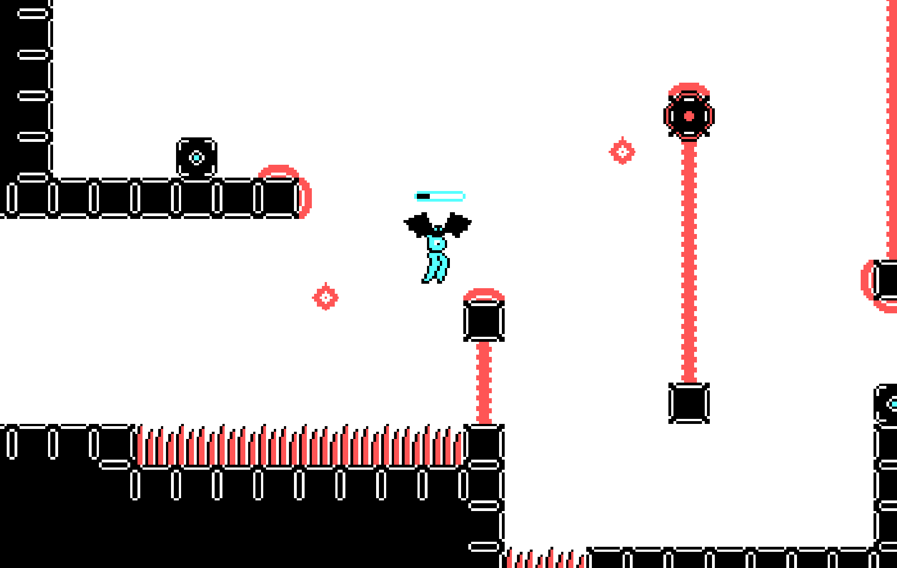
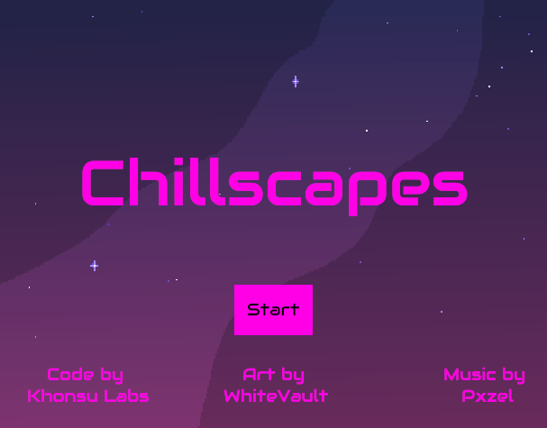
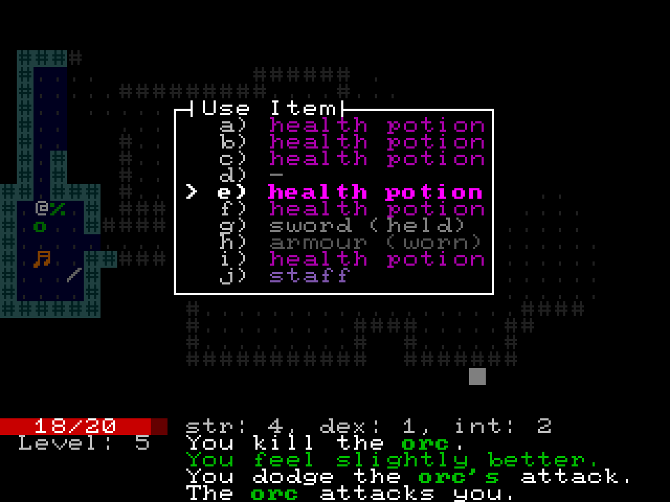
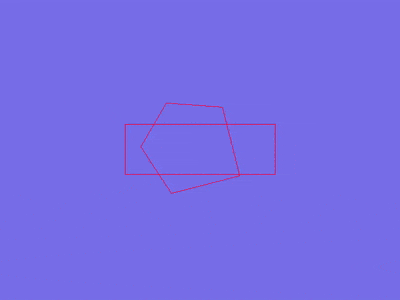
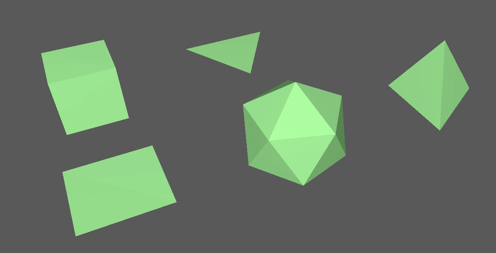
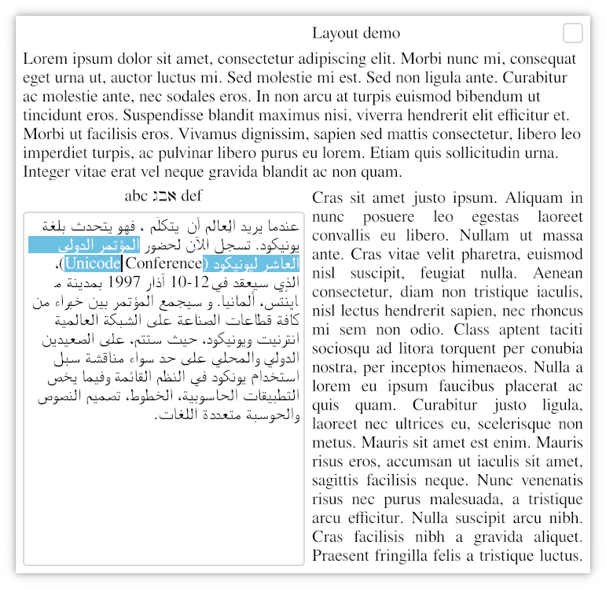
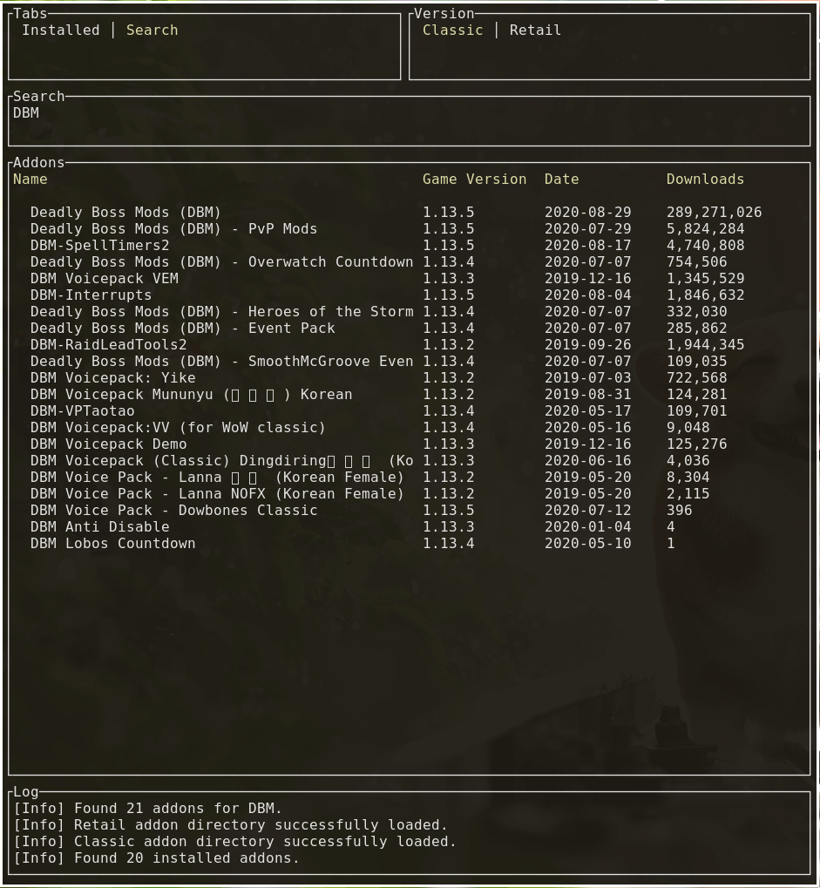

+++
title = "This Month in Rust GameDev #13 - August 2020"
date = 2020-09-07
transparent = true
draft = true
+++

Welcome to the 13th issue of the Rust GameDev Workgroup’s
monthly newsletter.
[Rust] is a systems language pursuing the trifecta:
safety, concurrency, and speed.
These goals are well-aligned with game development.
We hope to build an inviting ecosystem for anyone wishing
to use Rust in their development process!
Want to get involved? [Join the Rust GameDev working group!][join]

You can follow the newsletter creation process
by watching [the coordination issues][coordination].
Want something mentioned in the next newsletter?
[Send us a pull request][pr].
Feel free to send PRs about your own projects!

[Rust]: https://rust-lang.org
[join]: https://github.com/rust-gamedev/wg#join-the-fun
[pr]: https://github.com/rust-gamedev/rust-gamedev.github.io
[coordination]: https://github.com/rust-gamedev/rust-gamedev.github.io/issues?q=label%3Acoordination

Table of contents:

- [Game Updates](#game-updates)
- [Learning Material Updates](#learning-material-updates)
- [Library & Tooling Updates](#library-tooling-updates)
- [Popular Workgroup Issues in Github](#popular-workgroup-issues-in-github)
- [Meeting Minutes](#meeting-minutes)
- [Requests for Contribution](#requests-for-contribution)
- [Jobs](#jobs)
- [Bonus](#bonus)

<!--
Ideal section structure is:

```
### [Title]


A paragraph or two with a summary and [useful links].

_Discussions:
[/r/rust](https://reddit.com/r/rust/todo),
[twitter](https://twitter.com/todo/status/123456)_

[Title]: https://first.link
[useful links]: https://other.link
```

Discussion links are added only if they contain
some actual interesting discussions.

If needed, a section can be split into subsections with a "------" delimiter.
-->

## Game Updates

### [Crate Before Attack][cba-site]

[][cba-site]
_Debugging camera motion: highlighted areas are points of interest._

[Crate Before Attack][cba-site] by [koalefant (@CrateAttack)][@CrateAttack]
is a skill-based multiplayer game where frogs combat their friends
while navigating the landscape with their sticky tongues.

A [playable browser build][cba-play] can be tried online.

Recent changes are:

- Training mode improvements, including a new map [Dungeon][cba-youtube-dungeon]
  by [Kesha Astafyev][cba-spoon-tar].
- [Better camera motion][cba-youtube-camera-motion]:
  multiple points of interest are tracked dynamically.
- Improved GPU performance by merging multiple render passes into one.
- Added control hints.
- Numerous bugfixes and tweaks.

More details are in [August DevLog-entry][cba-august-update].

[cba-site]: https://cratebeforeattack.com
[cba-youtube-dungeon]: https://youtu.be/cukyVXQ0n0c
[cba-youtube-camera-motion]: https://youtu.be/3y7Hfa-v3e8
[cba-august-update]: https://cratebeforeattack.com/posts/20200831-august-update/
[cba-play]: https://cratebeforeattack.com/play
[cba-spoon-tar]: https://www.behance.net/spoon_tar
[@CrateAttack]: https://twitter.com/CrateAttack

### [A/B Street][abstreet]


[A/B Street][abstreet] is a traffic simulation game exploring how small changes
to roads affect cyclists, transit users, pedestrians, and drivers. Any city
with OpenStreetMap coverage can be used!

Some of this month's updates:

- Multiple traffic signals can be edited together.
- An [API][abstreet-api] and tools were added, to control maps and simulation
  from any language.
- [Michael Kirk][mkirk], a new team member, fixed HiDPI scaling issues in a
  consistent way.
- Many new cities imported, with better support for countries that drive on the
  left and support for using alternate languages from OpenStreetMap for roads
  and buildings.
- Backwards compatibility for a player's edits to the map.
- Two-way cycletracks and roads with multiple direction changes.

[abstreet]: https://abstreet.org
[abstreet-api]: https://dabreegster.github.io/abstreet/dev/api.html
[mkirk]: https://github.com/michaelkirk

### [Egregoria]



[Egregoria]'s objective is to become a granular society simulation,
filled with fully autonomous agents interacting with their world in real time.
Egregoria was previously known as Scale,
but was renamed to fit the theme better.

The [5th devlog][egregoria-blog-post] was published, talking about
the renaming, project managment, buildings and scripting.

A [Discord][egregoria-discord] server was launched to discuss the project.

_Discussions:
[/r/rust_gamedev](https://reddit.com/r/rust_gamedev/comments/igzbl9/egregoria_devblog_5)_

[Egregoria]: https://github.com/Uriopass/Egregoria
[egregoria-blog-post]: http://douady.paris/blog/egregoria_5.html
[egregoria-discord]: https://discord.gg/CAaZhUJ

### [Cary]

[][Cary]

In [Cary] the player has to bring the titular character to the exit by carying
them or otherwise making sure they don't – nor the player themselves –
touch any of the traps.
Easier said then done when you have limited stamina and Cary keeps running
into spikes.

Made with hecs and wgpu (no framework), but uses WebGL on the web
because of the current implementation status of WebGPU.

Made during the [Extra Credits game jam][extra-credits-jam],
it's a rather small game.
It can be played in the browser or downloaded at [itch.io][Cary].

[Cary]: https://specificprotagonist.itch.io/cary
[extra-credits-jam]: https://itch.io/jam/extra-credits-game-jam-6

### [Chillscapes][chillscapes-itch]



[Chillscapes][chillscapes-github] is a lo-fi
rhythm experience created for the [NEOC#03 Rhythm Game Jam][neoc]. Using
layerable lo-fi music tracks, the game has you tap with the rhythm of the loops
being added, before changing the music up by adding another loop into the mix.
Last week, [a retrospective update was published][chillscapes-retrospective]
reflecting on what the developer's takeaways were from the experience.

Chillscapes is written using an early-in-development 2d engine,
[Kludgine][kludgine]. For audio playback, rodio was utilized. The source code is
[available on GitHub][chillscapes-github].

[chillscapes-itch]: https://khonsulabs.itch.io/chillscapes
[chillscapes-github]: https://github.com/khonsulabs/chillscapes
[chillscapes-retrospective]: https://community.khonsulabs.com/t/chillscapes-retrospective-and-kludgine-update/28
[neoc]: https://itch.io/jam/neoc03-rhythm-jam
[kludgine]: https://github.com/khonsulabs/kludgine

### [Dwarf Seeks Fortune][dsf-github]

[][dsf-github]
_Collect all keys to unlock the door to the next level._

[Dwarf Seeks Fortune][dsf-github] is a puzzle-platformer made with the Amethyst game
engine. Its developer, Jazarro, has partnered with the Amethyst organization
to make it an official Amethyst showcase game. It aims to be a learning
resource for anyone looking to get started with Amethyst.

The game currently sports a growing feature set, two playable levels and an
early version of an integrated level editor. It is ready for your
contributions, so if you're interested, check out the
[contributor's guide][dsf-contributing] or the [good first issues][dsf-good-first-issues].
If you have any questions, open an issue on GitHub or approach
Jazarro on [the Amethyst discord][amethyst-discord].

[dsf-github]: https://github.com/amethyst/dwarf_seeks_fortune
[dsf-contributing]: https://github.com/amethyst/dwarf_seeks_fortune/blob/master/CONTRIBUTING.md
[dsf-good-first-issues]: https://github.com/amethyst/dwarf_seeks_fortune/issues?q=is%3Aissue+is%3Aopen+label%3A%22good+first+issue%22
[kv-ii]: https://en.wikipedia.org/wiki/King%27s_Valley_II
[amethyst-discord]: https://discord.com/invite/amethyst

## Learning Material Updates

### [Writing NES Emulator in Rust][rust_nes_tutorial]


"Writing NES Emulator in Rust" is a tutorial by [@bugzmanov] on creating a fully
capable NES/Famicom emulator from scratch in the online book format. It walks
through major steps of emulating NES platform components to run
all-time classics, like Pacman, Donkey Kong, and Super Mario Bros.

It's a fun way of getting into hardware internals and fundamentals of
computer systems. The tutorial also covers game-dev basics and how to
work with graphics in Rust using [SDL2][sdl2] library.

[rust_nes_tutorial]: https://bugzmanov.github.io/nes_ebook/index.html
[@bugzmanov]: https://twitter.com/bugzmanov
[sdl2]:https://www.libsdl.org/

### [Beginning Game Development with Amethyst][rustconf-talk-video]

[][rustconf-talk-video]
_Click to [watch the talk][rustconf-talk-video]._

Getting started with Rust + gamedev can be intimidating. At
[RustConf 2020][rust-conf-2020], [Micah Tigley] gave a talk about their experience
beginning game development using the [Amethyst][amethyst-link] game engine and
learning about ECS by implementing examples that aim to be accessible for
beginners.

Supporting blog posts for talk:

- [Creating a Simple Spritesheet Animation with Amethyst][micah-blog-part1]
- [Running Animation][micah-blog-part2]
- [Camera Follow System][micah-blog-part3]

The source code for the [demo can be found here][micah-demo-src].

[Micah Tigley]: https://twitter.com/micah_tigley
[rustconf-talk-video]: https://www.youtube.com/watch?v=GFi_EdS_s_c
[micah-blog-part1]: https://mtigley.dev/posts/sprite-animations-with-amethyst
[micah-blog-part2]: https://mtigley.dev/posts/running-animation
[micah-blog-part3]: https://mtigley.dev/posts/camera-follow-system
[micah-demo-src]: https://github.com/tigleym/sprite_animations_demo
[amethyst-link]: https://amethyst.rs/
[rust-conf-2020]: https://rustconf.com

### [Chargrid Roguelike Tutorial 2020][chargrid-roguelike-tutorial-2020]



[Chargrid][chargrid] by [@stevebob] is a collection of crates for building
applications with text UIs that run in terminals, graphical windows, and web
pages. It was made specifically with roguelike development in mind, though is
general-purpose enough to be used for other applications.

[Chargrid Roguelike Tutorial 2020][chargrid-roguelike-tutorial-2020]
is a tutorial series about making a traditional roguelike from scratch
using chargrid for rendering and input handling. Reference code is available in
[this git repo][chargrid-roguelike-tutorial-2020-reference-code]
organized with one branch for each subsection.

[chargrid-roguelike-tutorial-2020]: https://gridbugs.org/roguelike-tutorial-2020/
[chargrid-roguelike-tutorial-2020-reference-code]: https://github.com/stevebob/chargrid-roguelike-tutorial-2020
[chargrid]: https://github.com/stevebob/chargrid/
[@stevebob]: https://github.com/stevebob

## Library & Tooling Updates

### [Rapier: 2D and 3D Physics Engines Focused on Performance][rapier-august]

[][Rapier]

[Rapier] is a new set of 2D and 3D physics engines written 100% in Rust.
It is 5 to 10 times faster than [nphysics], close to the performances of the
CPU version of PhysX, and often slightly faster than Box2D.

[For its first release][rapier-august] Rapier includes:

- rigid-body dynamics;
- colliders and sensors;
- joint constraints;
- optional serialization of the physics state;
- optional cross-platform determinism on IEEE-754 compliant targets;
- optional explicit SIMD and parallelism.
- JavaScript bindings with official NPM packages.

This new physics engine is developed by the recently created [Dimforge]
single-member Open-Source company [replacing][dimforge-replace] the former
Rustsim organization created on GitHub by [@sebcrozet].

_Discussions:
[/r/rust](https://www.reddit.com/r/rust/comments/igkul2/announcing_rapier_2d_and_3d_physics_engines/)_

[Rapier]: https://rapier.rs
[rapier-august]: https://www.dimforge.com/blog/2020/08/25/announcing-the-rapier-physics-engine
[dimforge-replace]: https://www.dimforge.com/blog/2020/08/18/rustsim-becomes-dimforge
[Dimforge]: https://dimforge.com
[@sebcrozet]: https://github.com/sebcrozet/
[nphysics]: https://nphysics.org

### [cute-c2]



cute-c2 is a 2D collision detection library that has had its first release to
[crates.io][cute-c2]. The library is a Rust wrapper around the [c2.h] library.

The library can detect collisions between circles, rectangles, capsules and
up to eight-sided convex polygons. There are also functions for manifold
generation, the GJK algorithm and ray casting operations. There is an example
program in the repository.

[cute-c2]: https://crates.io/crates/c2
[c2.h]: https://github.com/RandyGaul/cute_headers/blob/master/cute_c2.h

### [hexasphere] v1.0



The [hexasphere] library provides a customizable interface for subdividing 3D
triangle meshes. Custom and stateful interpolation functions can be implemented
as well as per-vertex attributes.

All that's required to define a base shape are the initial vertices, triangles
based on the indices of the vertices in the initial vertices, and numbered
edges. As long as the winding of the triangles remains consistend throughout
the base mesh, all of the resulting triangles will retain that winding.

This library also provides a few interesting base shapes (which can be used alone
if the shape is not subdivided):
Icosahedron, Tetrahedron, Cube, Square Plane, Triangle Plane
(all of which are pictured above).

[hexasphere]: https://crates.io/crates/hexasphere

### [blitz-path](https://github.com/BezPowell/blitz-path)

[blitz-path](https://github.com/BezPowell/blitz-path) is a new crate providing
an implementation of the [JPS](https://en.wikipedia.org/wiki/Jump_point_search)
pathfinding algorithm.

JPS is an optimization of the A* search algorithm for uniform-cost grids, which
are common in games. While fully functional, the code is still in an early
state and any suggestions for improvements - especially on how best to
integrate it with the existing ecosystem - are greatly appreciated.

### [This Month in Mun][mun-august]

[][Mun]

[Mun] is a scripting language for gamedev focused on quick iteration times
that is written in Rust.

[August updates][mun-august] include:

- compiler support for type aliases;
- shared diagnostics between compiler and language server;
- support for the official [inkwell][mun-inkwell] crate;
- refactors and quality of life improvements.

[Mun]: https://mun-lang.org
[mun-august]: https://mun-lang.org/blog/2020/08/30/this-month-august/
[mun-inkwell]: https://crates.io/crates/inkwell

### [SPIR-Q] v0.4.6

[SPIR-Q] is a light-weight shader reflection library, which allows you to query
the types, offsets, sizes and even names in your shaders procedurally.

This month v0.4.2..v0.4.6 versions were released.
Some of the updates:

- Specialization constants enumeration.
- Dynamically sized multi-binding support.
- Improved entrypoint debug printing.
- Better manifest merging method for pipeline construction.
- Bugfixes and various small API improvments.

_Discussions: [/r/rust_gamedev][spirq-discussion]_

[SPIR-Q]: https://github.com/PENGUINLIONG/spirq-rs
[spirq-discussion]: https://reddit.com/r/rust_gamedev/comments/i6hxh6/spirq_042

### [Inline SPIR-V]


[Inline SPIR-V] is a single-crate build-time shader compilation library based on
shaderc which provides procedural macros to help you translate shader sources,
in either GLSL or HLSL, inline or from-file, into SPIR-Vs and embed the SPIR-Vs
right inside your code as `u32` slices. Despite basic shader compilation,
`inline-spirv` also support `#include` directives, macro substitution,
post-compile optimization, as well as descriptor auto-binding.

_Discussions: [/r/rust_gamedev][inline-spirv-discussion]_

[Inline SPIR-V]: https://github.com/PENGUINLIONG/inline-spirv-rs
[inline-spirv-discussion]: https://reddit.com/r/rust_gamedev/comments/ic1005/inline_spirv

### [KAS] v0.5 and [KAS-text] v0.1



[KAS] by [@dhardy] is a general purpose UI toolkit; its
initial aim is "old school" desktop apps with good keyboard and touchscreen
support. Unlike many modern immediate-mode UIs, KAS's widgets retain state,
allowing minimal per-frame updates. KAS supports embedded WebGPU graphics now,
and will (eventually) support being embedded within other contexts (requiring
only a supply of input events and implemention of some basic graphics routines).

KAS v0.5 switches to a new crate for text layout,
[KAS-text]. KAS-text is a text layout
engine supporting multi-line editing, shaping and bidirectional text; future
versions will also support formatting. KAS-text is not tied to any particular
raster or render system; its positioned-glyph output is relatively easy to
adapt to crates like `wgpu_glyph` and `gfx_glyph`.
For more, see the article ["Why I created KAS-text"][kas-article].

[KAS]: https://github.com/kas-gui/kas
[KAS-text]: https://github.com/kas-gui/kas-text
[kas-article]: https://kas-gui.github.io/blog/why-kas-text.html
[@dhardy]: https://github.com/dhardy

### [Egui]

[Egui] is a highly portable immediate mode GUI library in pure Rust.
Egui can be integrated anywhere you can paint textured triangles.
You can compile Egui to WASM and render it on a web page using [egui_web]
or compile and run natively using [egui_glium].

[Click to run Egui web demo](https://emilk.github.io/egui/index.html)

Example:

```rust
Window::new("Debug").show(ui.ctx(), |ui| {
    ui.label(format!("Hello, world {}", 123));
    if ui.button("Save").clicked {
        my_save_function();
    }
    ui.text_edit(&mut my_string);
    ui.add(Slider::f32(&mut value, 0.0..=1.0).text("float"));
});
```


_Discussions:
[/r/rust](https://reddit.com/r/rust/comments/hzwvsk/emigui_deserves_more_love)_

[Egui]: https://github.com/emilk/egui/
[egui_glium]: https://crates.io/crates/egui_glium
[egui_web]: https://crates.io/crates/egui_web

### Tetra

[Tetra] is a simple 2D game framework, inspired by XNA and Raylib. This month,
versions [0.4.1][tetra-041] and [0.4.2][tetra-042] were released, featuring:

- Improved Serde support
- Various fixes and improvements to the built-in `Camera` type
- Many documentation improvements, based on user feedback

In addition, Tetra 0.5 is planned for release in early September. For more
information on the upcoming changes, see the [changelog][tetra-changelog].

[tetra]: https://github.com/17cupsofcoffee/tetra
[tetra-041]: https://twitter.com/17cupsofcoffee/status/1289857217198317568
[tetra-042]: https://twitter.com/17cupsofcoffee/status/1294316642680426497
[tetra-changelog]: https://github.com/17cupsofcoffee/tetra/blob/main/CHANGELOG.md

### [starframe]


[starframe] by [@moletrooper] is a work-in-progress 2D game engine
for physics-y sidescrolling games. This month it received
[an experimental graph-based entity system][sf-graph-post].

The next area of focus is going to be fleshing out the physics with
generalized constraints, which will enable things like friction and joints.

_Discussions:
[/r/rust](https://www.reddit.com/r/rust/comments/iju3xq/starframe_devlog_architecture_ecs_graph/),
[twitter](https://twitter.com/moletrooper/status/1300034941816897542)_

[starframe]: https://github.com/moletrooper/starframe
[@moletrooper]: https://twitter.com/moletrooper
[sf-graph-post]: https://moletrooper.github.io/blog/2020/08/starframe-1-architecture/

### 🐦 [Puffin Profiler]

Pufin is a simple instrumentation profiler created by [Embark]
where you can opt-in to profile parts of your code.

```rust
fn my_function() {
    puffin::profile_function!():
    ...
    if ... {
        puffin::profile_scope_data!("load_image", image_name):
        ...
    }
}
```

The collected profile data can be viewed ingame with [imgui-rs].


[Puffin Profiler]: https://github.com/EmbarkStudios/puffin
[Embark]: https://www.embark-studios.com/
[imgui-rs]: https://github.com/Gekkio/imgui-rs

### [wowAddonManager] v1.0.2



The [wowAddonManager] is a terminal user interface for managing World of
Warcraft addons on Linux made by [@mreimsbach]. It allows installing addons
from [Curseforge] for WoW Classic as well as WoW Retail.

The [tui-rs] library was used to create the interface and [Termion] was used to
communicate with the TTY.

[wowAddonManager]: https://github.com/MR2011/wowAddonManager
[@mreimsbach]: https://twitter.com/mreimsbach
[Curseforge]: https://www.curseforge.com/wow/addons
[tui-rs]: https://github.com/fdehau/tui-rs
[Termion]: https://gitlab.redox-os.org/redox-os/termion

## Popular Workgroup Issues in Github

## Meeting Minutes

<!-- Up to 10 most important notes + a link to the full details -->

[See all meeting issues][label-meeting] including full text notes
or [join the next meeting][join].

[label-meeting]: https://github.com/rust-gamedev/wg/issues?q=label%3Ameeting

## Requests for Contribution

<!-- Links to "good first issue"-labels or direct links to specific tasks -->

- [Embark's open issues][embark-open-issues] ([embark.rs]).
- [winit's "Good first issue" and “help wanted” issues][winit-issues].
- [gfx-rs's "contributor-friendly" issues][gfx-issues].
- [wgpu's "help wanted" issues][wgpu-help-wanted].
- [luminance's "low hanging fruit" issues][luminance-fruits].
- [ggez's "good first issue" issues][ggez-issues].
- [Veloren's "beginner" issues][veloren-beginner].
- [Amethyst's "good first issue" issues][amethyst-issues].
- [A/B Street's "good first issue" issues][abstreet-issues].
- [Mun's "good first issue" issues][mun-issues].

[embark.rs]: https://embark.rs
[embark-open-issues]: https://github.com/search?q=user:EmbarkStudios+state:open
[winit-issues]: https://github.com/rust-windowing/winit/issues?utf8=✓&q=is%3Aissue+is%3Aopen+label%3A%22status%3A+help+wanted%22+label%3A%22Good+first+issue%22
[gfx-issues]: https://github.com/gfx-rs/gfx/issues?q=is%3Aissue+is%3Aopen+label%3Acontributor-friendly
[wgpu-help-wanted]: https://github.com/gfx-rs/wgpu-rs/issues?q=is%3Aissue+is%3Aopen+label%3A%22help+wanted%22
[luminance-fruits]: https://github.com/phaazon/luminance-rs/issues?q=is%3Aissue+is%3Aopen+label%3A%22low+hanging+fruit%22
[ggez-issues]: https://github.com/ggez/ggez/labels/%2AGOOD%20FIRST%20ISSUE%2A
[veloren-beginner]: https://gitlab.com/veloren/veloren/issues?label_name=beginner
[amethyst-issues]: https://github.com/amethyst/amethyst/issues?q=is%3Aissue+is%3Aopen+label%3A%22good+first+issue%22
[abstreet-issues]: https://github.com/dabreegster/abstreet/issues?q=is%3Aissue+is%3Aopen+label%3A%22good+first+issue%22
[mun-issues]: https://github.com/mun-lang/mun/labels/good%20first%20issue

## Jobs

<!-- An optional section for new jobs related to Rust gamedev -->

## Bonus

<!-- Bonus section to make the newsletter more interesting
and highlight events from the past. -->

Just an interesting Rust gamedev link from the past. :)

------

That's all news for today, thanks for reading!

Subscribe to [@rust_gamedev on Twitter][@rust_gamedev]
or [/r/rust_gamedev subreddit][/r/rust_gamedev] if you want to receive fresh news!

<!--
TODO: Add real links and un-comment once this post is published
**Discussions of this post**:
[/r/rust](TODO),
[twitter](TODO).
-->

[/r/rust_gamedev]: https://reddit.com/r/rust_gamedev
[@rust_gamedev]: https://twitter.com/rust_gamedev
