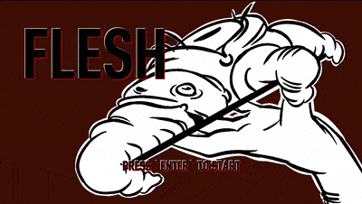
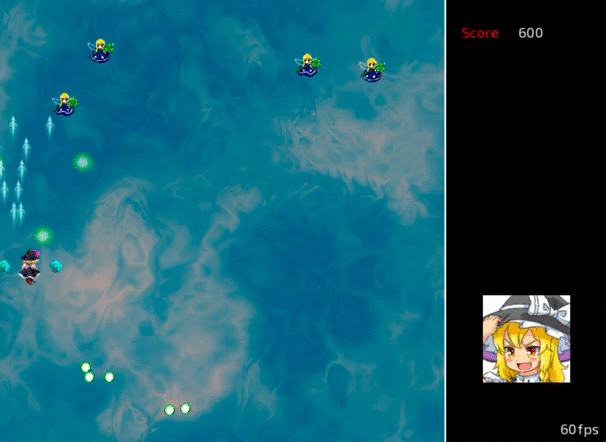
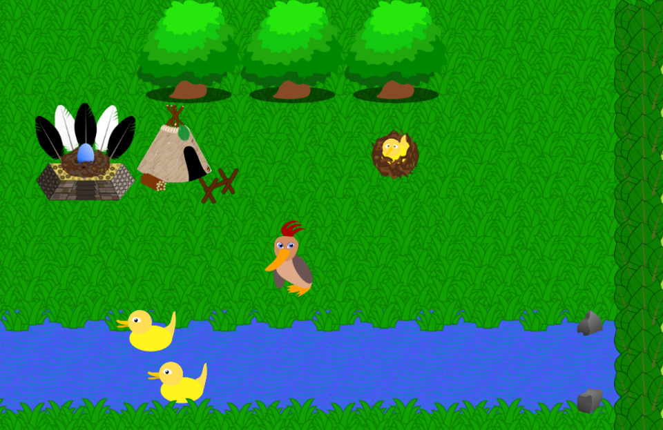
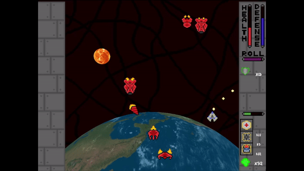
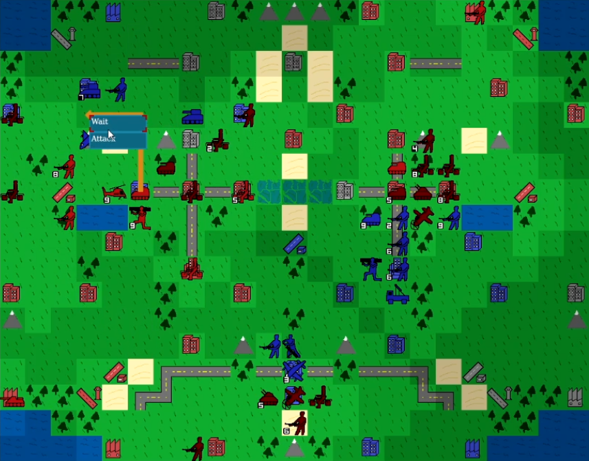
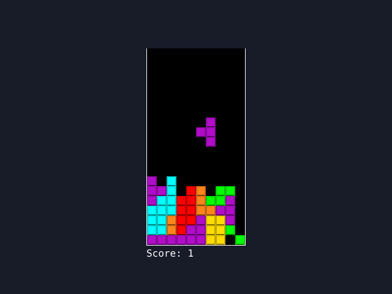
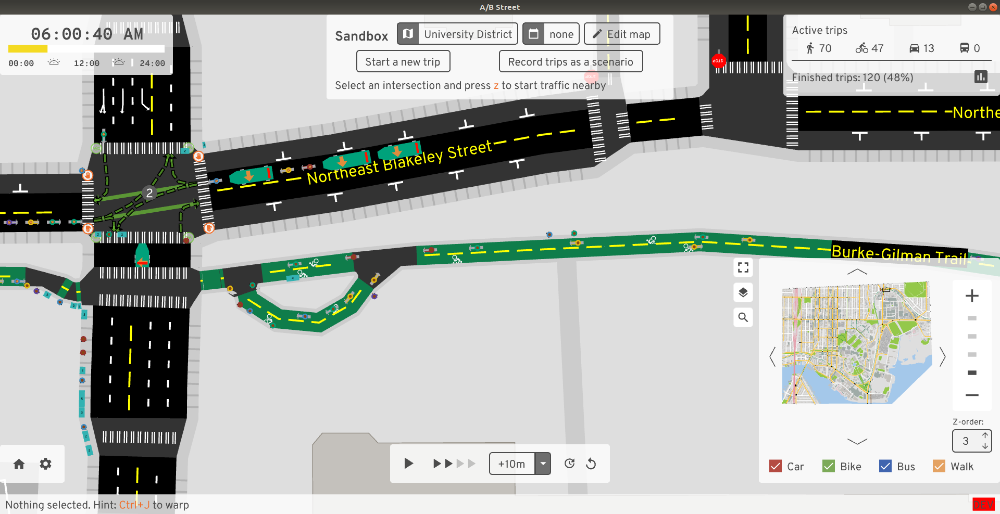

+++
title = "This Month in Rust GameDev #19 - February 2021"
date = 2021-03-03
transparent = true
draft = true
+++

Welcome to the 19th issue of the Rust GameDev Workgroup's
monthly newsletter.
[Rust] is a systems language pursuing the trifecta:
safety, concurrency, and speed.
These goals are well-aligned with game development.
We hope to build an inviting ecosystem for anyone wishing
to use Rust in their development process!
Want to get involved? [Join the Rust GameDev working group!][join]

You can follow the newsletter creation process
by watching [the coordination issues][coordination].
Want something mentioned in the next newsletter?
[Send us a pull request][pr].
Feel free to send PRs about your own projects!

[Rust]: https://rust-lang.org
[join]: https://github.com/rust-gamedev/wg#join-the-fun
[pr]: https://github.com/rust-gamedev/rust-gamedev.github.io
[coordination]: https://github.com/rust-gamedev/rust-gamedev.github.io/issues?q=label%3Acoordination
[Rust]: https://rust-lang.org
[join]: https://github.com/rust-gamedev/wg#join-the-fun

Table of contents:

- [Game Updates](#game-updates)
- [Learning Material Updates](#learning-material-updates)
- [Engine Updates](#engine-updates)
- [Library & Tooling Updates](#library-tooling-updates)
- [Popular Workgroup Issues in Github](#popular-workgroup-issues-in-github)
- [Requests for Contribution](#requests-for-contribution)

<!--
Ideal section structure is:

```
### [Title]


_image caption_

A paragraph or two with a summary and [useful links].

_Discussions:
[/r/rust](https://reddit.com/r/rust/todo),
[twitter](https://twitter.com/todo/status/123456)_

[Title]: https://first.link
[useful links]: https://other.link
```

If needed, a section can be split into subsections with a "------" delimiter.
-->

## Game Updates

### Flesh


_Title screen + gameplay_

Flesh by [@im_oab] is a 2D-horizontal shmup game with hand-drawn animation and
organic/fleshy theme. It is implemented using [tetra]. This month update include:

- Add title screen.
- Support gamepad.
- Add new enemy types for first level include mid-boss.

[@im_oab]: https://twitter.com/im_oab
[tetra]: https://github.com/17cupsofcoffee/tetra

### [Teki (敵)][teki]



[Teki][teki] is a free and open-source fangame of the [Tōhō] series
using [SDL2] and [Legion] for ECS. It is aimed to be a shoot ’em up game with
"lots of bullets" a.k.a danmaku 弾幕 - literally "barrage" or "bullet curtain" in
Japanese.

The project is still at a “very” early stage of development (Dec. 2020).

This month's updates include:

- New enemy type: big fairy
- New special card: Stellar Vortex
- Add yin yang orbs

[teki]: https://github.com/o2sh/teki
[Tōhō]: https://en.wikipedia.org/wiki/Touhou_Project
[SDL2]: https://github.com/Rust-SDL2/rust-sdl2
[Legion]: https://crates.io/crates/legion

### [Paddlers]



[Paddlers] ([GitHub][paddlers-gh], [Online Demo][paddlers-demo]) by [@jakmeier]
is an experimental MMORTS with the backend and the web client all written in
Rust.

February gave birth to Paddlers release 0.2.1 and a ton of new game mechanics.
It features a skill map, quests, and a refreshed take on the tower defense
aspect of the game. On top of that, the rendering engine (part of the
[Paddle][paddle] framework) has been reworked and now allows for custom
shaders. Read all about this month's changes in this
[article][paddlers-article] released on the developer's private website.

[Paddlers]: https://paddlers.ch
[paddlers-gh]: https://github.com/jakmeier/paddlers-browser-game
[paddlers-demo]: https://demo.paddlers.ch
[@jakmeier]: https://github.com/jakmeier
[paddle]: https://github.com/jakmeier/paddle
[paddlers-article]: https://www.jakobmeier.ch/blogging/Paddlers_6.html

### [Theta Wave]

[][Theta Wave]
_Homing missiles periodically spawn from missile launcher enemies_

[Theta Wave] is a space shooter game by developers [@micah_tigley] and
[@carlosupina]. It is one of the showcase games for the [Amethyst Engine].
In the past month, they have been focusing on refactoring the motion system
to make the code more approachable to other contributors.

Notable changes:

- Missiles now spawn from missile launcher enemies
- Cursed background slowly fades in over the course of the level

[Theta Wave]: https://github.com/amethyst/theta-wave
[@micah_tigley]: https://twitter.com/micah_tigley
[@carlosupina]: https://twitter.com/carlosupina
[Amethyst Engine]: https://amethyst.rs/

### [Project YAWC][yawc-twitter]



[Project YAWC][yawc-twitter] is a turn-based strategy game in development by junkmail.
February saw the release of Alpha 4, bringing special units and auctions to determine
ownership of special units, as well as changes to netcode, balance, and UI.

Those interested in participating in the alpha test should fill out this
[form][yawc-form].
To learn more, you can follow the new [@projectyawc][yawc-twitter] Twitter
or send an e-mail to projectyawc@gmail.com.

[yawc-form]: https://forms.gle/tzP6oRaJmApgMyrj7
[yawc-twitter]: https://twitter.com/projectyawc

## Learning Material Updates

## Engine Updates

### [Tetra]


_Tetra's demo game_

[Tetra] is a simple 2D game framework, inspired by XNA, Love2D and Raylib.
This month, version 0.6 was released, with some big changes and features:

- A simpler drawing API
- Less global state for mesh drawing
- Multisampled canvases
- Better font rendering

For more details, see the [changelog][tetra-changelog], or
[17cupsofcoffee's twitter thread][tetra-twitter] about the release.

[tetra]: https://github.com/17cupsofcoffee/tetra
[tetra-changelog]: https://github.com/17cupsofcoffee/tetra/blob/main/CHANGELOG.md
[tetra-twitter]: https://twitter.com/17cupsofcoffee/status/1357750836370284544

### [A/B Street]



[A/B Street] by [@dabreegster] is a traffic simulation game exploring how small
changes to roads affect cyclists, transit users, pedestrians, and drivers, with
suppot for any city with OpenStreetMap coverage.

In February, [Bruce] implemented lagging green traffic signals, [Michael] and
[Yuwen] released the new day UI theme, more cyclepaths and service roads were
imported for all maps, and we added loads of maps, a new per-country picker UI,
and dynamic font loading. Try out [Taipei] in the web browser to see all of
this in action!

[A/B Street]: https://github.com/a-b-street/abstreet
[@dabreegster]: https://twitter.com/CarlinoDustin
[Bruce]: https://github.com/BruceBrown
[Michael]: https://github.com/michaelkirk
[Yuwen]: https://www.yuwen-li.com/
[Taipei]: http://abstreet.s3-website.us-east-2.amazonaws.com/dev/game/?--dev&tw/taipei/maps/center.bin

## Library & Tooling Updates

### [Rafx][rafx-github]


Rafx is a multi-backend renderer that optionally integrates with the
[distill][rafx-distill] asset pipeline. Rafx is divided into three tiers of
functionality:

`rafx-api` provides a custom GPU API abstraction layer that currently supports
vulkan and metal. ([API in rust psuedocode][rafx-api-design])

`rafx-framework` builds on the API layer using ideas found in modern shipping
AAA titles. Rendering is pipelined in a separate thread in three phases, using
jobs to extract data from the main thread, process the data on the render
thread, and write the draw calls to command buffers.
[[Tatarchuk 2015][rafx-gdc-2015]] A render graph ensures correct
synchronization. [[O'Donnell 2017][rafx-gdc-2017]] The framework also provides
a material abstraction and shader pipeline.

`rafx-assets` adds integration with the [distill][rafx-distill] asset pipeline.
This ensures that when an asset like a mesh is loaded, other related assets
like textures/material/vertex data are loaded. By integrating with distill,
rafx provides advanced features like streaming live asset updates to remote
devices.

More information about rafx:

- [Github][rafx-github]
- [Documentation][rafx-documentation]
- [Why Rafx?][why-rafx] (includes similarities/differences with other rust
  and non-rust alternatives)

[rafx-github]: https://github.com/aclysma/rafx
[rafx-documentation]: https://github.com/aclysma/rafx/blob/master/docs/index.md
[why-rafx]: https://github.com/aclysma/rafx/blob/master/docs/why_rafx.md
[rafx-api-design]: https://github.com/aclysma/rafx/blob/master/docs/api/api_design_in_rust_psuedocode.rs
[rafx-api-triangle-example]: https://github.com/aclysma/rafx/blob/master/rafx/examples/api_triangle/api_triangle.rs
[rafx-gdc-2015]: http://advances.realtimerendering.com/destiny/gdc_2015/Tatarchuk_GDC_2015__Destiny_Renderer_web.pdf
[rafx-gdc-2017]: https://www.gdcvault.com/play/1024612/FrameGraph-Extensible-Rendering-Architecture-in
[rafx-distill]: https://github.com/amethyst/distill

### [basis-universal-rs]

`basis-universal` provides bindings for [Binomial LLC][binomial-llc]'s
[Basis Universal texture codec][basis-universal-upstream].

Basis Universal is a state-of-the art
[supercompressed][basis-universal-supercompression] texture codec that
was recently [open-sourced][basis-universal-open-sourced] by Binomial in
partnership with Google. It was
[contributed][basis-universal-contributed-kronos] to the Khronos glTF
3D Transmission Open Standard.

The library has two primary uses:

- Compresses and encode textures "offline" to a custom format
- Transcoding: Unpack the custom format directly to GPU-friendly compressed
  formats. The final format can be chosen at game runtime to be compatible
  with available GPU hardware.

Basis universal format can also store mipmapped textures and cubemaps,
neither of which is possible with "normal" file formats. Mipmaps can be
generated by the library during compression.

Compression is very slow (around 7-10s for a 2k texture) but transcoding is
relatively fast (around 5-40ms for a 2k texture depending on quality). Memory
savings at runtime are generally >= 75% (depending on the transcode format
and quality)

[binomial-llc]: http://www.binomial.info
[basis-universal-rs]: https://github.com/aclysma/basis-universal-rs
[basis-universal-upstream]: https://github.com/BinomialLLC/basis_universal
[basis-universal-supercompression]: http://gamma.cs.unc.edu/GST/gst.pdf
[basis-universal-open-sourced]: https://opensource.googleblog.com/2019/05/google-and-binomial-partner-to-open.html
[basis-universal-contributed-kronos]: https://www.khronos.org/blog/google-and-binomial-contribute-basis-universal-texture-format-to-khronos-gltf-3d-transmission-open-standard

### [egui]


[egui] by [@emilk] is an easy-to-use immediate mode GUI library in pure Rust.

This month [versions 0.9 and 0.10] of egui were released with many
improvements big and small, including a 2D plot, more text styles,
disabling widgets and improved documentation.

You can try out egui in the [online demo].

[egui]: https://github.com/emilk/egui
[online demo]: https://emilk.github.io/egui
[versions 0.9 and 0.10]: https://github.com/emilk/egui/blob/master/CHANGELOG.md
[@emilk]: https://twitter.com/ernerfeldt

### [rkyv]

[rkyv] is a zero-copy deserialization framework for Rust. It's similar to
FlatBuffers and Cap'n Proto and can be used for data storage and messaging.

[Version 0.4][rkyv-v0.4] was released this month and brought some big changes
and improvements:

- Major traits have been refactored and renamed to clarify their roles
- Shared pointers (`Rc`, `Arc`, `Weak`) can now be serialized, deserialized,
  and validated with correct ownership semantics
- Serialization, deserialization, and validation all now support custom contexts
- Greatly improved support for 32- and 64-bit archives by implementing Archive
  for `usize` and `isize`
- More comprehensive documentation in the [book][rkyv-book]

This release completes the project's initial feature set, and a
[request for feedback][rkyv-request-for-feedback] has been opened to help with
future project planning.

[rkyv]: https://github.com/djkoloski/rkyv
[rkyv-v0.4]: https://github.com/djkoloski/rkyv/releases/tag/v0.4.0
[rkyv-book]: https://djkoloski.github.io/rkyv
[rkyv-request-for-feedback]: https://github.com/djkoloski/rkyv/issues/67

### [This Month in Mun][mun-february]

[][Mun]

[Mun] is a scripting language for gamedev focused on quick iteration times
that is written in Rust.

It's been a long time coming, but the Mun Core Team is closing in on the finish
line for Mun v0.3. They are only a couple of pull requests away from locking
the build for bug fixes and documentation. The [February updates][mun-february]
include:

- `use` statements language support;
- incremental file updates for the language server;
- LLVM 11 support;
- bug fixes and other improvements.

[Mun]: https://mun-lang.org
[mun-february]: https://mun-lang.org/blog/2021/03/04/this-month-february

## Popular Workgroup Issues in Github

<!-- Up to 10 links to interesting issues -->

## Requests for Contribution

<!-- Links to "good first issue"-labels or direct links to specific tasks -->

- [Embark's open issues][embark-open-issues] ([embark.rs]).
- [gfx-rs's "contributor-friendly" issues][gfx-issues].
- [wgpu's "help wanted" issues][wgpu-help-wanted].
- [luminance's "low hanging fruit" issues][luminance-fruits].
- [ggez's "good first issue" issues][ggez-issues].
- [Veloren's "beginner" issues][veloren-beginner].
- [Amethyst's "good first issue" issues][amethyst-issues].
- [A/B Street's "good first issue" issues][abstreet-issues].
- [Mun's "good first issue" issues][mun-issues].
- [SIMple Mechanic's good first issues][simm-issues].
- [Bevy's "good first issue" issues][bevy-issues].

[embark.rs]: https://embark.rs
[embark-open-issues]: https://github.com/search?q=user:EmbarkStudios+state:open
[gfx-issues]: https://github.com/gfx-rs/gfx/issues?q=is%3Aissue+is%3Aopen+label%3Acontributor-friendly
[wgpu-help-wanted]: https://github.com/gfx-rs/wgpu-rs/issues?q=is%3Aissue+is%3Aopen+label%3A%22help+wanted%22
[luminance-fruits]: https://github.com/phaazon/luminance-rs/issues?q=is%3Aissue+is%3Aopen+label%3A%22low+hanging+fruit%22
[ggez-issues]: https://github.com/ggez/ggez/labels/%2AGOOD%20FIRST%20ISSUE%2A
[veloren-beginner]: https://gitlab.com/veloren/veloren/issues?label_name=beginner
[amethyst-issues]: https://github.com/amethyst/amethyst/issues?q=is%3Aissue+is%3Aopen+label%3A%22good+first+issue%22
[abstreet-issues]: https://github.com/a-b-street/abstreet/issues?q=is%3Aissue+is%3Aopen+label%3A%22good+first+issue%22
[mun-issues]: https://github.com/mun-lang/mun/labels/good%20first%20issue
[simm-issues]: https://github.com/mkhan45/SIMple-Mechanics/labels/good%20first%20issue
[bevy-issues]: https://github.com/bevyengine/bevy/labels/good%20first%20issue

------

That's all news for today, thanks for reading!

Want something mentioned in the next newsletter?
[Send us a pull request][pr].

Also, subscribe to [@rust_gamedev on Twitter][@rust_gamedev]
or [/r/rust_gamedev subreddit][/r/rust_gamedev] if you want to receive fresh news!

<!--
TODO: Add real links and un-comment once this post is published
**Discussions of this post**:
[/r/rust](TODO),
[twitter](TODO).
-->

[/r/rust_gamedev]: https://reddit.com/r/rust_gamedev
[@rust_gamedev]: https://twitter.com/rust_gamedev
[pr]: https://github.com/rust-gamedev/rust-gamedev.github.io
