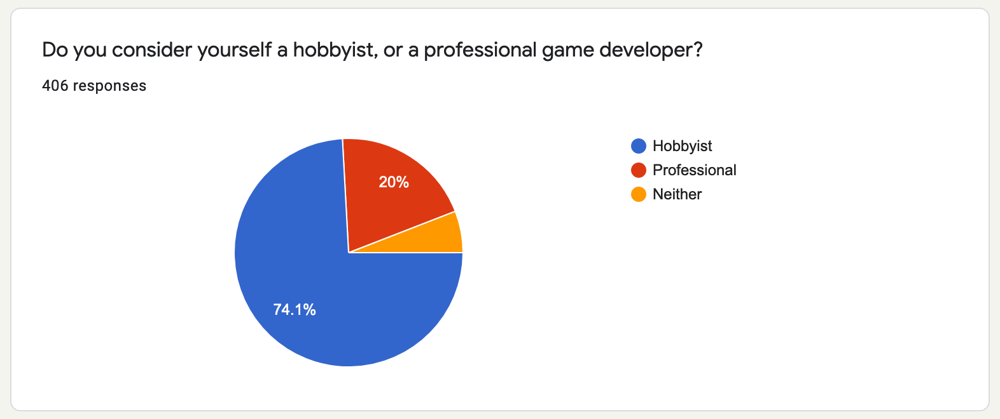
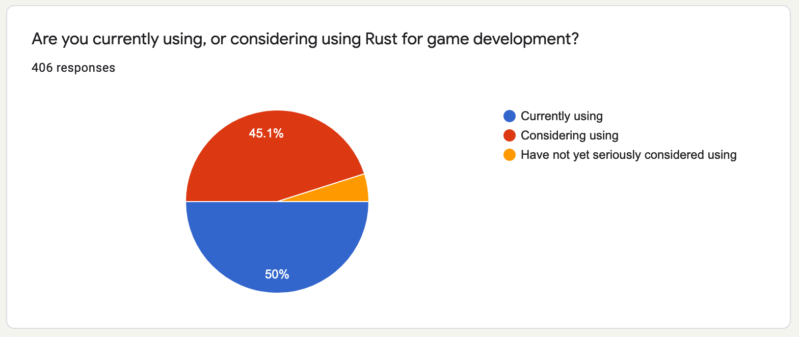
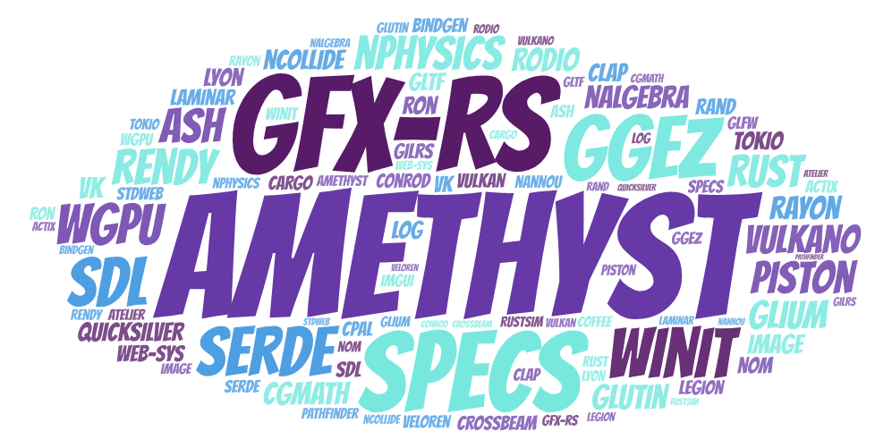

+++
title = "Rust Game Development - Ecosystem Survey"
draft = true
+++

In August last year, we conducted a survey for the Rust gamedev ecosystem. After an unfortunate delay, we can finally present the results. We received a whopping 403 responses! This trove of valuable feedback will inform the WG's roadmap for 2020.

# Hobbyist or developer?

Out of the 400 respondents, 3/4 identified as a _Hobbyist_. It should also be noted that a significant portion of the self-identified _Professionals_ are more accurately described as "aspiring professional" undertaking their first game development venture. That still amounts to a large amount of commercial interest in Rust game development all the same!

# Are you using Rust for gamedev?

Among the Professionals only 1/4 said they are currently using Rust in games. That means the 200 respondents currently using Rust for gamedev are mostly hobbyists. No surprise there, as most professionals can't bear the risk of being an early adopter. Big shoutout to all the hobbyists who are pushing the status quo, and kudos to the handful of studios that are using Rust in production long before most of their industry peers have even caught the scent.

---

_For the free-form answers that follow, a basic eyeballs&hands sentiment analysis was used to distill 400 replies into digestible form. The (#) number next to a heading indicate roughly the number of times that topic came up. Think of it as the **signal strength** of a given topic._

## What about Rust as a language and ecosystem presents the biggest NEGATIVES for you as a game developer right now?

Priorities for professionals and hobbyists are largely the same. The biggest differences were:

- Hobbyists call for ecosystem maturity 2x more than anything else.

- Hobbyists care much more about mobile/web support

- Professionals care much more about console support

- Professionals care much more about C++ interop

### Ecosystem maturity (114)

* From playing in the space I know it's possible to make games using Rust. However in the ecosystem my biggest negatives is the [lack of] case studies and demonstrations of it working.

* Rust is still a risky choice, compared to C++.

* Still feels like a new community. There is always risk associated with that - does the language take a big swing in direction - does support drop off. I'm encouraged by the support for low level (embedded / OS ) development, which hopefully means the core feature set remains robust.

* Many unfinished, unmaintained crates. Lots of churn.

* A lot of common needs are not yet available 'out of the box'.

### Iteration times (68)

* Compile time, no runtime reflection, updating deep dependency in the tree is hard.

* Iteration time is I think too big, due to compilation time, [lack of] hot-reloading tooling, etc.

* Iteration time (especially while prototyping). This includes both compile time but also sorting out lifetimes when I know I'll be rewriting something very soon anyway, this "frontloading" the effort of having the borrow checker run at compile time is useful for most tasks but when I want to try something quickly it can be a draining experience, in this regard GC'd languages have an advantage imo.

* Prototyping seems not as easy in Rust due to "fighting the compiler"

###  Documentation (43)

* Not enough documentation to get past beginner stage

* Lacking examples for gamedev libs.

* Documentation is usually either high level or examples but rarely both. Very few real world examples to draw from.

### Lack of full-featured engines (35)

* Lack of a data-and-script based engine like Unreal Engine or Unity means even small projects end up feeling very bring-your-own-engine.

* Missing graphical editors, frictionless prototyping of games

### Rust learning curve / onboarding to a niche language (29)

* The language has a higher upfront cognitive load than any other mainstream language I know of, mostly due to the borrow checker. It's very hard to hack through stuff and get away with it, which makes it a particularly hard sell for game prototypes.

* I know that it is a less common language to use so as a company I will have to have my staff learn Rust before they can start.

* Rust could be tricky to hire for, and hiring someone who doesn't know Rust to work in Rust will come with a ramp-up period.

### IDE/RLS story (28)

Tooling around IDE is limited compared to Visual Studio with C++ or C#.´

* Definitely lack of proper IDE (like out of the box Cargo integration and working debugger - yeah, I tested Visual Studio Code and it's very slow, suggestions are not great, fastest way to run, check and build is to use terminal - not IDE) - I would say that something like QT Creator or Visual Studio would be great

* Regarding debugging, the industry standard is (or that I'm aware of) Visual Studio, for its very good IDE and tools, also, a lot of users are very used to that kind of tools and looks like Rust is missing some of them.

* rust-analyzer is still very incomplete, but it's the only thing that works for me

* Poor IDE and debugging support in IDE. Mainly visual studio.

* Can't debug it properly, hashmap (for example) is absolutely not debuggable. Not sure how it works inside (instead of C++).

- debug mode way too slow, often need to set opt-level=1 or 2 for dev profile

### GUI tooling (23)

* As a tools developer, a major negative point is the current absence of a reliable GUI framework (we use WPF + C# with Visual Studio).

### Game consoles (13)

* No first party support for console development makes Rust a tough sell for a lot of professional work.

* Rust is not officially supported on console by Sony or Microsoft.

* Rust can't be seriously considered yet, because it does not have support from the PS4 SDK. Although there are other considerations (studio culture, integration with existing systems, etc.), official support from Sony is a requirement before Rust could be used in a PS4 game.

### Web/mobile support (14)

### Allocators (10)

### C++ interop (7)

Our code, and any middleware/engine that we might license, is in C++. Using Rust and C++ together is painful, and rewriting the existing tech to be purely Rust would be very expensive.

Testing and too much things linked to C.

* Also, no professional game engine (UE4, Unity) integrates with Rust yet.

* Unknown compatibility

- Lack of a straightforward path to make rust work easily with C++ in both directions. The only trustable way I see now is through manual C wrappers, which is error-prone and time consuming.

# What about Rust as a language and ecosystem presents the biggest POSITIVES for you as a game developer right now?

### Safety (100)
* Strong type system allows for easily enforcing some performance and safety best practices
* Multithreading safety
* Elimination of data races greatly improves reliability for multithreaded code.
* Safe concurrency

### Performance (89)
* Great performance and compile time verifications
* Performance and reliability
* Parallelism

### Community (69)
* the ecosystem is full of passionate and smart people who take quality software very seriously
* a really welcoming community with great goals and courage to pursue them
* Collective community effort to "build the right thing" and "build the thing right"

### Cargo (57)
* being able to pull down libraries piecemeal and have them build with your stuff immediately is great

### Ecosystem (50)
* A mature Rust ecosystem will (hopefully!) have a lower bar for entry than a mature C++ ecosystem, without giving up performance.

### WASM (web)  support (20)

### No garbage collection (8)

### ECS; data-driven; data-oriented (8)

### Cross platform (5)

### C interop (3)

## Selected quotes

> The language has a higher upfront cognitive load than any other mainstream language. Which means that on an established, bigger project (maybe with a team behind) the productivity is amazing compared to C++! It's much easier to express strong & safe interfaces that make bugs just harder to introduce.
It really shines in network code that needs to be 100% safe and resist bad actors! My current game server code has 0 unwraps/panics/expects and so I just *know* it can't crash... I wish I could have that feeling in C++.
C++ on the contrary makes it easy to whip up something which then has a 20% crash rate and tanks perf and takes 2 weeks to hammer into shape, and after those 2 weeks it looks like Rust code anyway.
Unfortunately, knowing the management culture in the gamedev industry, Rust has an extremely hard road in front of it due to this. In my experience gamedev is plagued by extreme short term (like, 1 month) reasoning resulting in crunches and awful technical tradeoffs. Rust made many choices that delay that fateful "demo day with the execs" because it forces you to do things right. But very few can express why this is valuable up the chain and be listened to.

> I love Rust!
> • it's perfect for "API-minded" systems programmers
> • as more production users come, things will get very good very quickly
> • being cross-platform is easier than ever
> • refactoring is very fun
> • proc macros are cool as heck
> • serde is insanely useful
> • seriously there's a ton of awesome crates
> • I know we'll get there together!

> We are especially interested in data-driven games for procedural generation and AI. Rust seems a great fit for this computationally intensive work.

> Since most game developers are tinkerers more than engineers or scientists, the whole industry is plagued with bad code quality, lack of architecture and bad code design. Undefined behavior, nullptr exceptions, use after freed, multithreading issues and so on are recurrent problems. Rust biggest positive is really the fact that it addresses all that without needing to change the people behind the games. That's why I believe in it so much :).
> Also worth noting that the module system and crates are really important nowadays because monolithic codebases of millions of lines of code is really a hell to work into.

## What do you think should be the game-dev working group's priorities for the next 3-6 months?

### Documentation (107)

- better onboarding to rust gamedev
- Better explanation of best practices
- How to get started
- Rust for seasoned gamedevs
- What works *right now*?
- Example games
- Standard practices for common gamedev problems
- How to do windowing
- How to do graphics
- How to do ECS
- More documentation for foundational libraries

### Cross-platform support (59)

- Lobby for Rust adoption on next-gen consoles.
- Clearer information about console support.
- Start an entity capable of getting and maintain console NDAs to keep official rust builds made for console support. It’s a huge pain, but other open source projects do it, and it would be awesome for the community.
- Wasm/web support (heavier from hobbyists)
- Paint a clearer picture of what the path to gaming consoles looks like, within the confines of what those proprietary SDKs and APIs allow.
- Mobile support
- Easier packaging
- Cross-compiling
- XR (AR/VR)

### Ecosystem promotion & coordination (51)

- Develop contacts within the industry so that the WG can be a liaison between industry and OSS developers. By inviting and involving industry, the ecosystem can grow and potentially receive support (in the form of PRs, open sourcing existing tools, or financial support for OSS developers.)
- Encourage & facilitate collaboration on existing tools.
- Library “blessings”
- more things like this survey
- Ecosystem mapping
- Outreach / evangelising
- Game jams
- Better insight into WG’s current agenda
- Come up with ways to unblock foundational projects if they get stuck
- Identify in-progress issues, and propose new issues, for the Rust language, that are relevant to game development. (For example, debug Rust is very slow, so we need good ways to control what is and isn't optimized.)
- Seek opportunities to address cross-cutting concerns where possible. The recent investigation into raw-window-handle and evaluation of if we can/should converge on a math library are both good examples.

### First-grade game engine/framework (46)

- Simple 2D game engine
- Basic editor workflow
- An SDL-like
- A Unity/Unreal competitor

### Graphics libraries (33)

- Improve accessibility of graphics programming

### Foundational libraries (27)

- UI libraries
- Windowing
- Audio
- Graphics
- Collection of “Standard crates” with some form of WG support
- Push for stabilisation

### Faster iteration times (17)

- Hot code reloading
- Scripting
- Faster compile times
- More libraries like Processing

### Integration with existing toolchains (14)

- C/C++
- Xcode, Android studio, Visual studio, Blender
- Unity/Unreal/Godot

### Custom allocation story (10)

### Debugging support and IDE integration (5)

### Interoperability between libraries (5)

## Can you name some libraries you are thankful for or take special interest in?
Just for fun, we asked respondents to name libraries or projects they were thankful for. In the 6 months that have passed since this survey went out there's been quite a few newcomers on the rise that would probably show more prominently here if we asked again today. Rest assured there will be more surveys.

_Thanks so much to the survey respondents and all the people out there working tirelessly make Rust a first-tier language and ecosystem for game development._